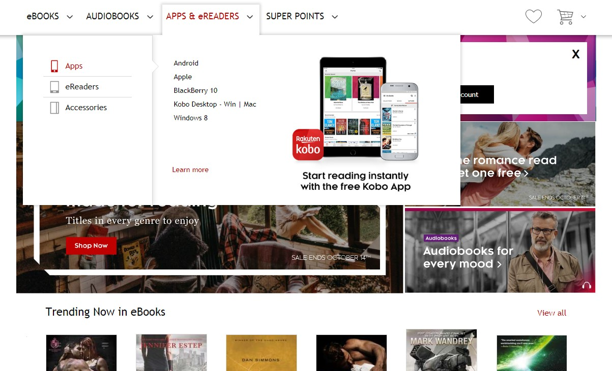
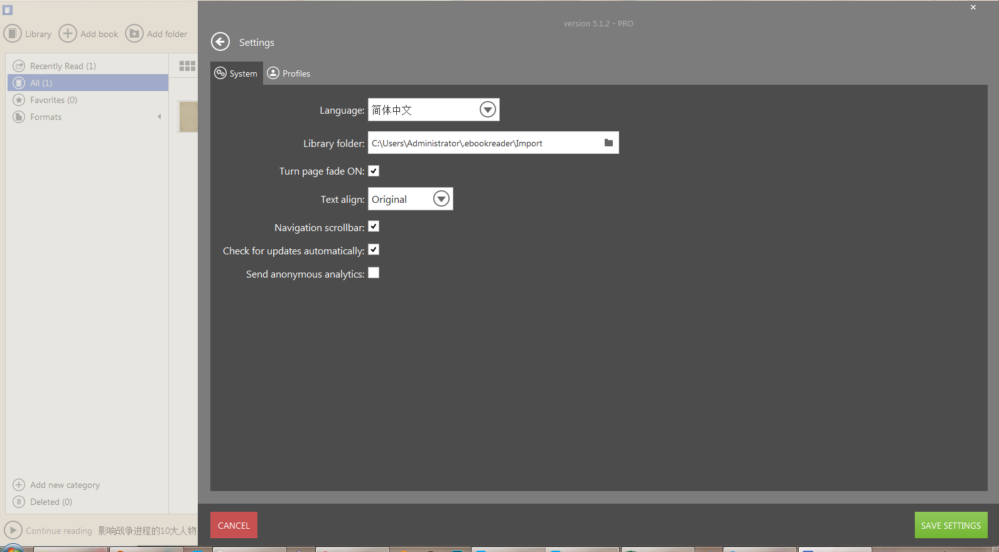
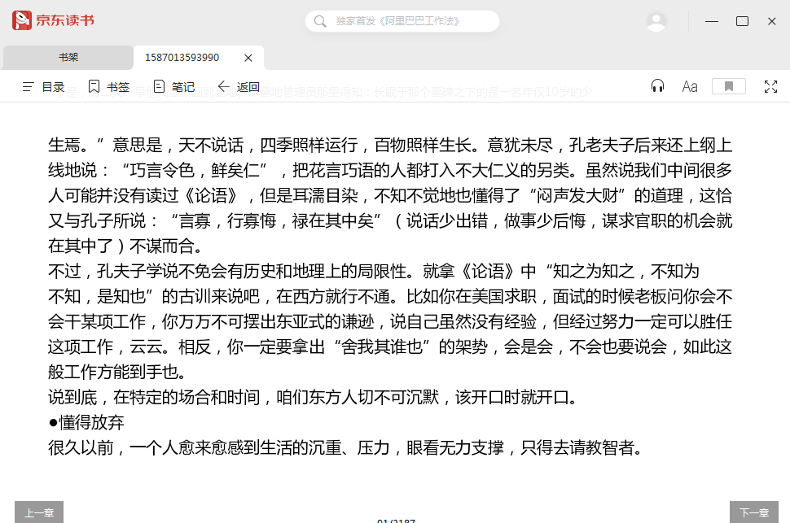

## Calibre
 

一款开源的电子书制作及阅读软件，功能十分强大，提供网页转书籍，格式转换等的一站式电子图书馆，可定制化程度相当高，适合折腾。

支持[`Windows` 、`macOS`、 `Linux`]

## NeatReader
 

新世代 ePub 阅读器

## JiffyReader

 Faster Reading on ANY website

https://www.jiffyreader.com/

Chrome插件: https://chrome.google.com/webstore/detail/jiffy-reader/lljedihjnnjjefafchaljkhbpfhfkdic

## 可道阅读器Koodo Reader

一个开源跨平台的电子书阅读器，支持Windows和网页版， 支持多种主流电子书格式， 内置笔记，高亮，翻译功能。

GITEE：https://gitee.com/troyeguo/koodo-reader

Github：https://github.com/troyeguo/koodo-reader

## Kobo

来自日本的功能强大的电子书管理和转换软件或者电子书阅读器。

## 稻壳阅读器

一款内置海量文档资源的极速阅读器,界面简洁、办公高效，让您阅读更加专注，支持pdf、epub、mobi、azw3, CAJ Viewer(https://cajviewer.cnki.net/) 的国内平替

## Ebook Reader(冰淇淋电子书阅读器)

Icecream出品的强大电子书阅读器，支持epub、mobi等，打开大文件慢/中文可能乱码.

旗下PDF编辑器：https://icecreamapps.com/PDF-Editor/

## 京东阅读

京东出品的精美电子书阅读器，支持epub。

## iReader

iRead 爱读书, 挺好用的小说阅读器，类似实体书般的体验与丝滑，但与掌阅iReader并没有实质关系

 [华军](http://soft.onlinedown.net/soft/73391.htm)

----

电子书设备: 掌阅Smart 3 (大屏),  汉王 N10 mini, 文石leaf2, Kindle