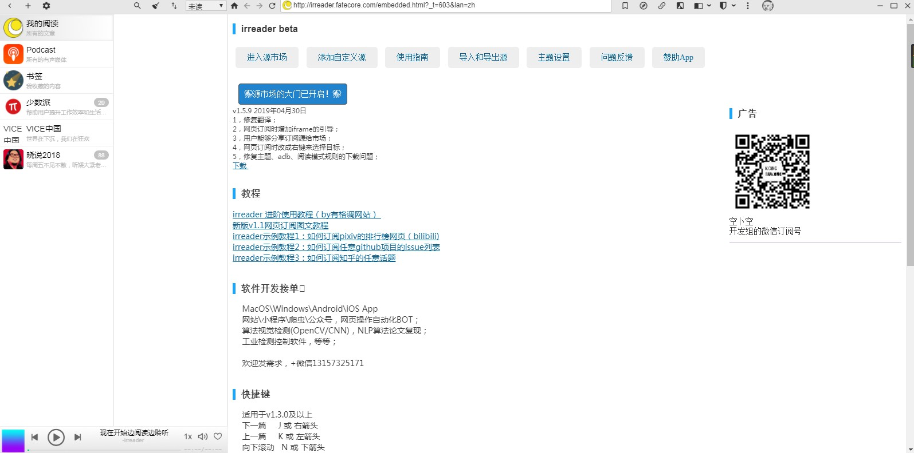
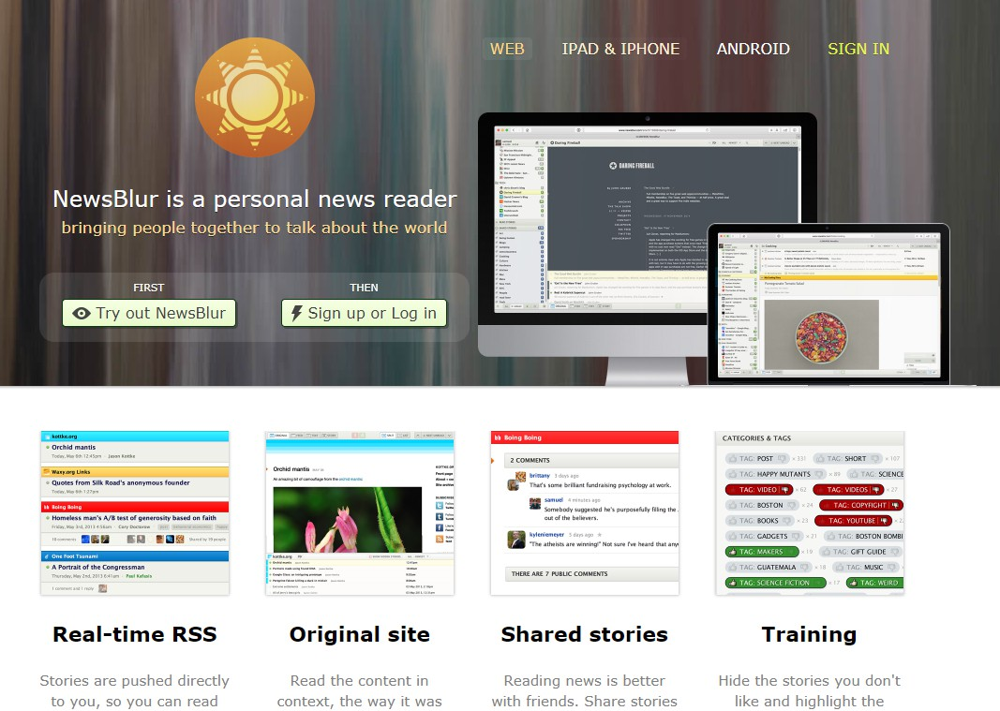
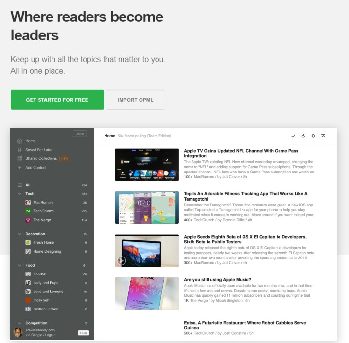
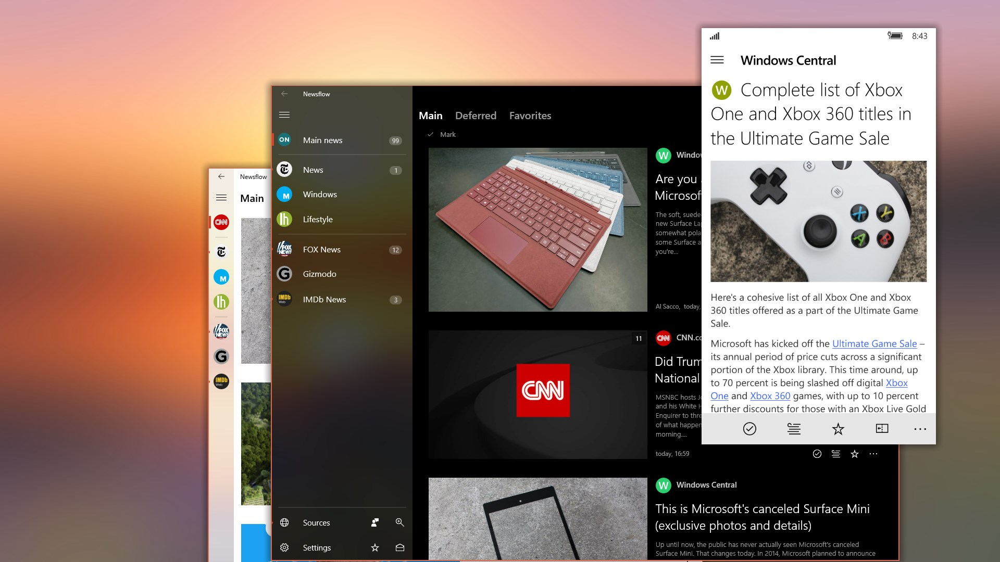
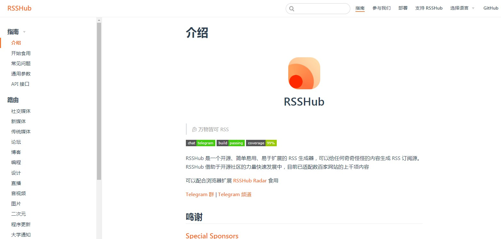

## RSS

RSS(Really Simple Syndication，简易信息聚合), 即是将新闻资讯、博客文章等的即时内容整理排版后，通过RSS阅读器让用户进行快速查看与阅读，是使用最广泛的`XML`应用。

但相比Zaker，Flipboard，~~即刻~~，轻芒阅读这样的社会化媒体聚合阅读工具，RSS更偏向于订阅。

在碎片化的信息爆炸时代里，信息不仅需要过滤，更需要有价值地传递给用户。

### Irreader   

> 订阅网页、RSS和Podcast，具备急速的阅读体验，
> 高品质、免费、无广告、多平台的阅读器。
> 泛用型Podcast播放器。

支持 [`MacOS` `Windows`], 还可添加无 RSS 源的网站。

### BlueReader 

> 连接一切你关心的
> 可订阅RSS或任意网站链接等，一切你关心的皆可订阅

支持[`Web` 、 `Android`、`iOS`]的简洁大方的RSS阅读器，也可添加一些无 RSS 源的网站，还有Chrome收藏插件，十分方便。

### Inoreader  

> The content reader for power users who want to save time.

支持[`Android`、`iOS`、` Windows Phone`、`Web`]的跨平台RSS阅读器，一个网络内容收藏者们的活力聚集地。

### NewsBlur 

> NewsBlur is a personal news reader
> bringing people together to talk about the world

支持[`Web` 、 `Android`、`iOS`]的老牌RSS阅读器。

### Feedly  

> Keep up with all the topics that matter to you. All in one place.

支持[`Web` 、 `Android`、`iOS`]的现代化老牌RSS阅读器。

### Newsflow   

被誉为UMP上最好的RSS阅读器。

## 常用稳定订阅源

- 爱范儿: http://www.ifanr.com/feed
- 少数派: https://sspai.com/feed
- ...

集合推荐：

RSS Source: https://rss-source.com/

RSSHub: https://docs.rsshub.app/

## 已挂的类似服务

一览阅读

鲜果阅读

Google Reader