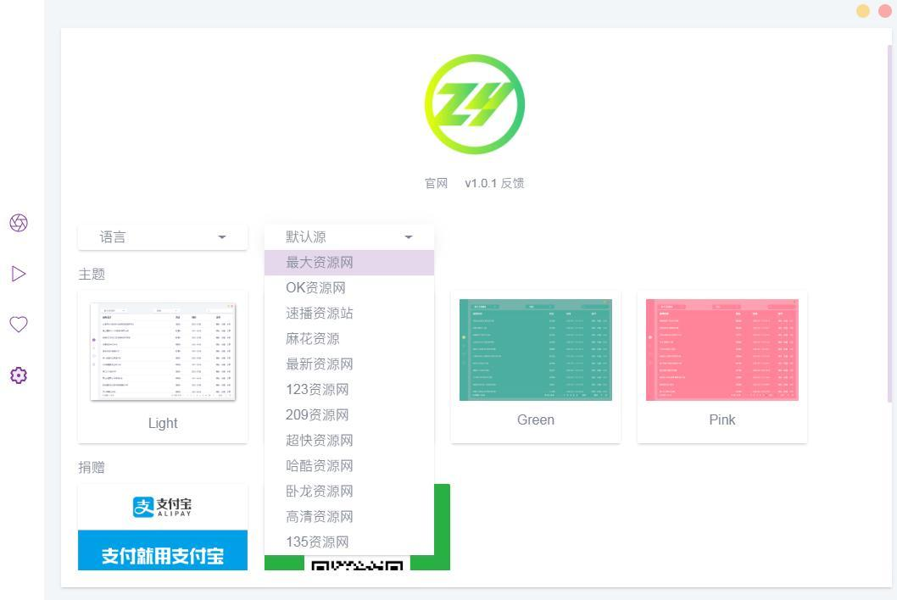

## PotPlayer 
[](http://potplayer.daum.net/)  

出自韩国[KMPlayer](https://www.kmplayer.com/home)[跨平台，基于MPC]作者姜勇囍的强大播放器，支持几乎所有视频格式、支持硬件加速、支持0.1~12倍速播放、支持添加直播源、支持自定义配置美化，但需花大量时间研究符合自己需求的配置 。


## MadVR
[](http://www.madvr.com/)

一款极为强大的高清播放视频插件,配合譬如PotPlayer等软件,可以实现PC上播放高清视频的最强画质。

## VLC
[](http://www.videolan.org/vlc/)   [](https://github.com/videolan/vlc)

> VLC 是一款自由、开源的跨平台多媒体播放器及框架，可播放大多数多媒体文件，以及 DVD、音频 CD、VCD 及各类流媒体协议。

**Plays everything**

* Files, Discs, Webcams, Devices and Streams.
* **Plays most codecs with no codec packs needed**
* MPEG-2, MPEG-4, H.264, MKV, WebM, WMV, MP3...
* **Runs on all platforms**
* Windows, Linux, Mac OS X, Unix, iOS, Android ...
* **Completely Free**
* no spyware, no ads and no user tracking.

## Splash
[](https://mirillis.com/splash-requirements)   

一款由波兰 Mirillis 软件公司出品的专为解码全高清(UltraHD)影片而打造的高级视频播放器, 界面简洁美观， 操作方便。


## 爱奇艺万能播放器
[](https://store.iqiyi.com/web/iqiyi/detail/qisuyingyin.action)

集成Kaku播放内核, 来自百度爱奇艺的视频播放器，支持几乎所有主流视频格式，支持截取gif以及强大的截图功能。

## Filmly
[](https://filmly.163.com/)

网易出品播放器, 聚合影片资源，智能识别影片信息，自动刮削封面海报，无需下载视频，流畅在线播放，跨平台跨设备同步，优雅打造私人影视库， 支持IOS，Android，TV，MAcOS.

## 射手影音
[](http://www.splayer.org/)

来自射手网，小巧开源，首创自动匹配字幕功能，可以智能翻译的播放器

## QQ影音
[](https://player.qq.com/)

来自腾讯的视频播放器，用户群庞大，全格式、高清都是标配，不过最近更新还是2020年4月。

[腾讯为何下架 QQ 影音所有版本？](https://www.zhihu.com/question/537549298/answer/3063126163)

## 迅雷播放器
[](https://www.xunlei.com/)

迅雷下载内置播放器

## 恒星播放器
[](https://www.stellarplayer.com/)

来自国产，支持超高清4K，蓝光HDR，ISO。支持多显卡AI协同解码、一键投屏甚至madVR的免费、无广告、无弹窗播放器。

##  完美解码

完美解码是一款为高清影视爱好者精心打造的影音解码包，能软硬件解码播放流行的视频和音频格式。集成多媒体播放器PotPlayer、MPC-HC、MPC-BE，分离器解码器套件LAV Filters，高画质渲染器madVR，支持中英语言安装使用，画质远超主流播放器！

Pure Codec，https://jm.wmzhe.com/

下载地址：https://www.wmzhe.com/ （此站下载速度慢，不推荐）

## ZY-Player

[](http://zyplayer.fun)    [](https://github.com/Hunlongyu/ZY-Player)

Github二次开发：https://github.com/Hiram-Wong/ZyPlayer

 ZY-Player简洁无广告高颜值全网影视资源播放器，聚合大量影视网站搜索接口， 跨平台支持[`Windows` 、`macOS`、 `Linux`]的桌面端资源播放器，, 支持视频分类以及 收藏夹同步更新追剧等， 支持第三方播放器播放。



常用订阅地址：

```
 https://jsd.cdn.zzko.cn/gh/ls125781003/dmtg@master/zy.json
 https://jsd.cdn.zzko.cn/gh/ls125781003/dmtg@main/zy_yuan.json
 http://xiaoguozitv.cn/catys/zyplay.json
 https://jsd.cdn.zzko.cn/gh/ls125781003/dmtg@master/zy.json
 https://fastly.jsdelivr.net/gh/ls125781003/dmtg@main/zy_yuan.json
```

> ZYPlayer 支持 tvbox 接口，但导入 tvbox 接口存在一些 bug，兼容性有点问题，期待后续版本解决该问题。目前导入上面链接可以正常的使用。


## 5KPlayer
[](https://www.5kplayer.com/)
支持 Airplay、广播电台与一些视频站点下载功能的通用多媒体播放器

## MPV
[](http://mpv.io/) [](https://github.com/mpv-player/mpv)

> mpv is a media player based on MPlayer and mplayer2. It supports a wide variety of video file formats, audio and video codecs, and subtitle types.

MPV是著名开源播放器mplayer和mplayer2的一个分支。

免费开源跨平台媒体播放器

## MPV-EASY Player
[](http://www.rjno1.com/mpv-easy-player.html) [](https://github.com/422658476/MPV-EASY-Player)

由软件No1开发的一个易于使用,基于MPV的播放器，最大限度地保留了原有的 mpv 外观

## MPC-BE
[](https://sourceforge.net/projects/mpcbe/)

基于 "Media Player Classic"(MPC，Gabest)


## Open Broadcaster Software
[](https://obsproject.com/)

免费开源的视频录制和流媒体播放软件。

## SMPlayer
[](https://sourceforge.net/projects/smplayer/) 

多媒体播放器，可针对不同视频保存不同的配置。

## VR-X PLAYER
[](https://www.vegascreativesoftware.com/us/vr-x-player/)

来自vegas团队的支持[`Windows10` 、 `Android`、`iOS`]的VR播放器。

## 其他播放器

国产播放器：暴风影音

QuickTime 