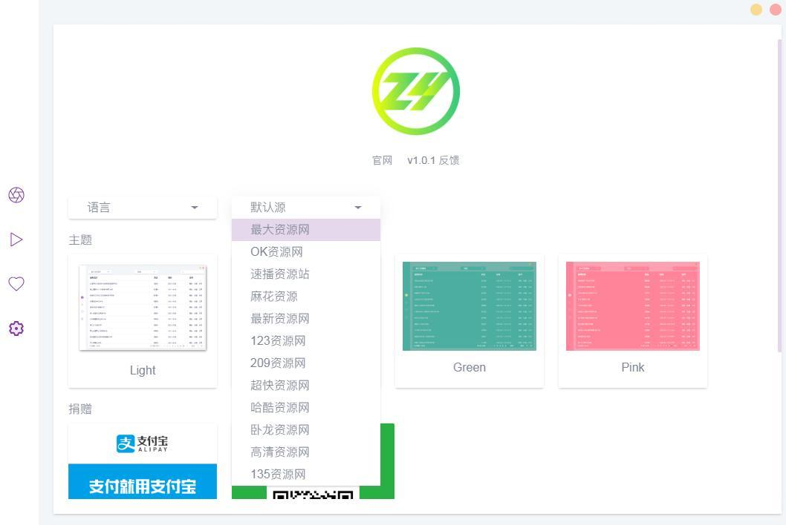

## ZY-Player

[](http://zyplayer.fun)    [](https://github.com/Hunlongyu/ZY-Player)

Github二次开发：https://github.com/Hiram-Wong/ZyPlayer

 ZY-Player简洁无广告高颜值全网影视资源播放器，聚合大量影视网站搜索接口， 跨平台支持[`Windows` 、`macOS`、 `Linux`]的桌面端资源播放器，, 支持视频分类以及 收藏夹同步更新追剧等， 支持第三方播放器播放。



常用订阅地址：

```
 https://jsd.cdn.zzko.cn/gh/ls125781003/dmtg@master/zy.json
 https://jsd.cdn.zzko.cn/gh/ls125781003/dmtg@main/zy_yuan.json
 http://xiaoguozitv.cn/catys/zyplay.json
 https://jsd.cdn.zzko.cn/gh/ls125781003/dmtg@master/zy.json
 https://fastly.jsdelivr.net/gh/ls125781003/dmtg@main/zy_yuan.json
```

> ZYPlayer 支持 tvbox 接口，但导入 tvbox 接口存在一些 bug，兼容性有点问题，期待后续版本解决该问题。目前导入上面链接可以正常的使用。

## EMDB

[](http://www.emdb.eu/)

一款跟踪电影和电视连续剧以及进行收藏管理的应用。

## TinyMediaManager

[](http://www.tinymediamanager.org/) [](https://gitlab.com/tinyMediaManager)  

开源的本地电影、电视剧管理工具，可自动下载影片信息、字幕、标记已观看等。

## Seriesgui

[](https://seriesgui.de/)

可记录追剧进度，数据源来自 [TheTVDB](https://www.thetvdb.com/?ref=appinn)