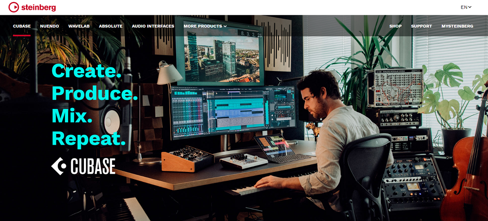

### Cubase  

来自著名steinberg公司的专业功能强大音频处理编辑软件，用于创建，录制，编辑和制作音乐。

### Nuendo  

同来自著名steinberg公司的专业的音频制作软件。

### Mixxx  

DJ混音软件

### FLstudio  

> FL Studio is a complete software music production environment to compose, arrange, record, edit, mix and master professional quality music.

Fruity Loops Studio 简称FL，国人习惯叫它"水果", 强大的电子音乐创作与混音平台。

### Melodyne  

一款专业的调音软件，提供音频编辑、高音校正、和声、时间拉伸等多项功能，以及颇为强大的MIDI编辑。

