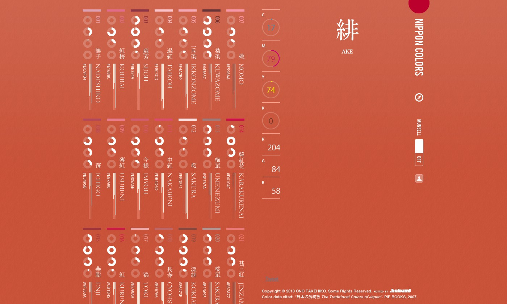
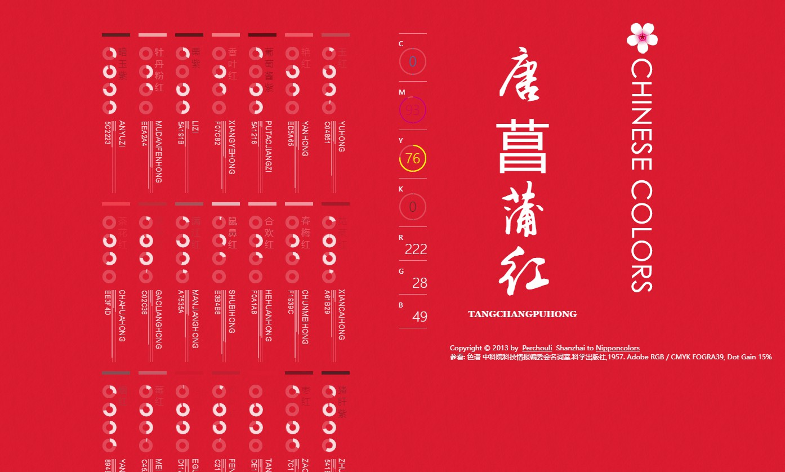
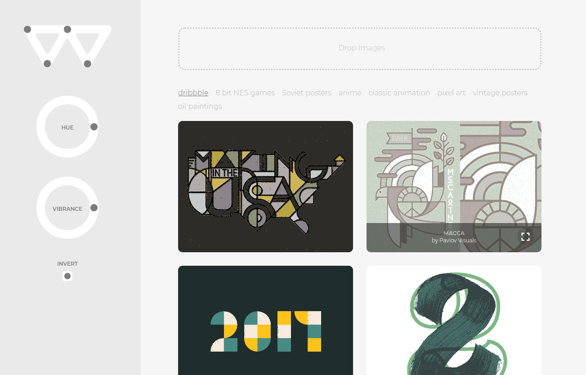

# 🌈 颜色工具

## 传统颜色

### 日本の伝統色

日本传统色: http://nipponcolors.com/

色見本と配色サイト color-sample: https://www.color-sample.com/

### 中国传统颜色

中国传统色: http://zhongguose.com/

## 专业配色

### Adobe Color CC

[https://color.adobe.com/zh/create/color-wheel/](https://color.adobe.com/zh/create/color-wheel/)

### Paletton

[https://paletton.com/](https://paletton.com)

### AI 配色工具

[https://brandmark.io/color-wheel/](https://brandmark.io/color-wheel/)

## 颜色灵感

Discover Art & Design Inspiration 从图片中获取颜色灵感

### colorhunter

colorhunter 只要上传一张照片就能提取配色方案,此外网站额外包含了一系列漂亮的色彩组合可供现成使用。

http://www.colorhunter.com/

### colrd

http://colrd.com/

### colourlovers

https://www.colourlovers.com/

## 设计配色

### Materialpalette

MD设计配色

[https://www.materialpalette.com](https://www.materialpalette.com/blue/light-blue)

.png>)

### Hamburgers by Jonathan Suh

网页CSS配色

汉堡图标的集合 Tasty CSS-animated hamburgers：https://jonsuh.com/hamburgers/

.png>)

### uiGradients

渐变色搭配，可以直接引用CSS代码

https://uigradients.com

### Flat UI

Flat UI Colors 2 features 13 more color palettes for COPY / PASTE for your next project, design, presentation.

https://flatuicolors.com/

## 颜色工具

### 取色工具

* Colorpix: 一款体积小巧功能超强的屏幕取色软件。

  > 或者浏览器自带的取色器  F12 --style，嗯嗯
  
* jcpicker

* My取色器

*  Pixie  

  nattyware开发的只有11KB大小的颜色选取器。

### 颜色转换工具

颜色转换工具RGB，CMYK ， HSV等 colorhexa：https://www.colorhexa.com/

spycolor：https://www.spycolor.com/

> Color conversion tools RGB, CMYK, HSV & more

CMYK工具：https://eng.fontke.com/tool/cmyk/

### HTML Color

简单的HTML颜色教程

html-color-codes：https://html-color-codes.info/

0to255：https://www.0to255.com/

### AI调色板

ColorMagic:  AI调色板生成工具, https://www.obviously.ai/

Huemint: AI调色生成工具, https://huemint.com/

Color Wheel: AI灰度logo或插画上色工具, https://brandmark.io/color-wheel/

Eva Design System: 基于深度学习的色彩生成工具, https://colors.eva.design/

---

[https://www.uisdc.com/tag/配色技巧](https://www.uisdc.com/tag/%E9%85%8D%E8%89%B2%E6%8A%80%E5%B7%A7)

