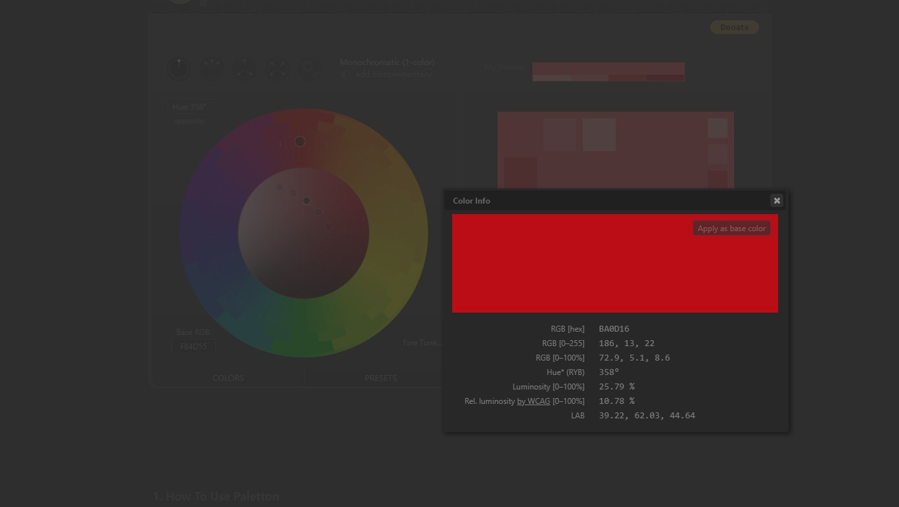

## 传统颜色

### 日本の伝統色

日本传统色: http://nipponcolors.com/

色見本と配色サイト color-sample: https://www.color-sample.com/

### 中国传统颜色

中国传统色: http://zhongguose.com/

## 专业配色

### Adobe Color CC

[https://color.adobe.com/zh/create/color-wheel/](https://color.adobe.com/zh/create/color-wheel/)

### Paletton

[https://paletton.com/](https://paletton.com)

### AI 配色工具

[https://brandmark.io/color-wheel/](https://brandmark.io/color-wheel/)

## 颜色灵感

Discover Art & Design Inspiration 从图片中获取颜色灵感

### colorhunter

colorhunter 只要上传一张照片就能提取配色方案,此外网站额外包含了一系列漂亮的色彩组合可供现成使用。


http://www.colorhunter.com/


### colrd


http://colrd.com/


### colourlovers


https://www.colourlovers.com/


## 设计配色

### Materialpalette

MD设计配色

[https://www.materialpalette.com](https://www.materialpalette.com/blue/light-blue)

.png>)

### Hamburgers by Jonathan Suh

网页CSS配色

汉堡图标的集合 Tasty CSS-animated hamburgers：https://jonsuh.com/hamburgers/

.png>)

### uiGradients

渐变色搭配，可以直接引用CSS代码



### Flat UI

Flat UI Colors 2 features 13 more color palettes for COPY / PASTE for your next project, design, presentation.



## 颜色工具

颜色转换工具RGB，CMYK ， HSV等
colorhexa：https://www.colorhexa.com/


spycolor：https://www.spycolor.com/


### HTML Color

简单的HTML颜色教程

html-color-codes：

https://html-color-codes.info/


0to255：

https://www.0to255.com/


