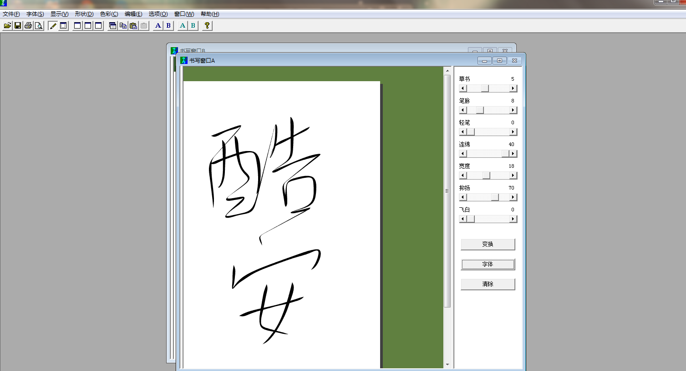

# 🖋 字体

## 字体软件

### HelloFont 字由

一站式字体管理、预览、备份与范例展示，可以快速在PPT、PS、AI等软件中找到你想要的字体。

<video width="720" controls>   <source src="https://resource.hellofont.cn/download/guide.mp4" type="video/mp4">  您的浏览器不支持Video标签。 </video>
### MacType
  

> Better font rendering for Windows.

使用简洁优雅的Mactype字体渲染，改善系统显示效果, 支持[`Windows` 、`macOS`]。

### Ougishi
 

神奇的毛笔字生成软件。

(心愿)： https://www.wishdown.com/soft/16114.html#a3

### Fontcreator

 一款专业的可用来制作字体(TTF)的专业字体设计软件。

 https://www.high-logic.com/font-editor/fontcreator

### FontForge

 一款专业的可用来制作字体(TTF)的专业字体设计软件。

https://fontforge.org/

### NexusFont

字体管理软件，Best font manager for Windows

https://www.xiles.app/

## 字体网站

### Fontke

https://eng.fontke.com/tool

## 字体识别

英文字体

Identify Fonts - The Font Squirrel Matcherator：[https://www.fontsquirrel.com/matcherator](https://www.fontsquirrel.com/matcherator)

WhatTheFont! « MyFonts： [https://www.myfonts.com/WhatTheFont/](https://www.myfonts.com/WhatTheFont/)

中文字体

[https://www.likefont.com/](https://www.likefont.com)

[https://www.qiuziti.com/](https://www.qiuziti.com)

字体推荐

[http://www.zhaozi.cn/html/fonts/](http://www.zhaozi.cn/html/fonts/)

AI字体推荐: [https://brandmark.io/font-generator/](https://brandmark.io/font-generator/)

## 字体下载

站长字体下载-分享PS字体、免费字体、商业字体库：[https://font.chinaz.com/](https://font.chinaz.com)

FontSpace：[https://www.fontspace.com/](https://www.fontspace.com)

## 字体生成

Stylish letters, symbols & cool fonts online 😍：[https://coolsymbol.com/cool-fancy-text-generator.html](https://coolsymbol.com/cool-fancy-text-generator.html)

Instagram Fonts Generator (𝓬𝓸𝓹𝔂 𝕒𝕟𝕕 𝓅𝒶𝓈𝓉𝑒) ― IGFonts.io: [https://igfonts.io/](https://igfonts.io)

第一字体转换

名章篆刻生成：[https://hanzi.unihan.com.cn/Signet](https://hanzi.unihan.com.cn/Signet)

* 泼墨字体转换器在线生成器: [http://www.diyiziti.com/Builder/129](http://www.diyiziti.com/Builder/129)

彩虹字生成器

[https://www.qqxiuzi.cn/zh/caihongzi/index.htm](https://www.qqxiuzi.cn/zh/caihongzi/index.htm)

乱码文字生成器

[https://www.qqxiuzi.cn/zh/luanma/](https://www.qqxiuzi.cn/zh/luanma/)

翻转文字生成器

[http://www.fliptext.org/](http://www.fliptext.org)

花里胡哨字体生成器(字母)

[https://nickfinder.com/fancy-text](https://nickfinder.com/fancy-text)

[https://nickfinder.com/make-it-fancy](https://nickfinder.com/make-it-fancy)

[https://nickfinder.com/fancy-writer](https://nickfinder.com/fancy-writer)

艺术字体在线生成器

[http://www.akuziti.com/](http://www.akuziti.com)

花样字体生成器 ： [https://www.jiuwa.net/hywz/](https://www.jiuwa.net/hywz/) (九娃工具箱)

花藤字体在线生成器: [https://www.jiuwa.net/htt/

i2style: CSS文字样式生成器

[http://www.i2style.org/](http://www.i2style.org)

[http://www.i2arabic.com/](http://www.i2arabic.com)

i2Clipart: [https://www.i2clipart.com/](https://www.i2clipart.com) 

剪切画网站
i2Type: [http://www.i2type.com/](http://www.i2type.com)
[注音输入法http://www.i2bopomo.com/](http://www.i2bopomo.com)
i2Speak is a smart online international phonetic alphabet (IPA) keyboard: [ http://www.i2speak.com/](http://www.i2speak.com)\
[h](http://www.i2arabic.com)拉[p://www.i2arabic.com/](http://www.i2arabic.com)i

## WEB字体

CSS Font Stack： [https://www.cssfontstack.com/](https://www.cssfontstack.com)

> A complete collection of web safe CSS font stacks

Type Scale：[https://type-scale.com/](https://type-scale.com)

> Preview and choose the right type scale for your project. Experiment with font size, scale and different webfonts.

Everything Fonts：[https://everythingfonts.com/](https://everythingfonts.com)

[https://open-foundry.com/fonts](https://open-foundry.com/fonts)

> A platform for open-source fonts in a noise-free environment; to highlight their beauty and encourage further exploration.

FlowType.JS: [https://github.com/simplefocus/FlowType.JS](https://github.com/simplefocus/FlowType.JS) / [https://simplefocus.com/flowtype/](https://simplefocus.com/flowtype/)

> Web typography at its finest: font-size and line-height based on element width.

typeset.css: [https://github.com/stormwarning/typeset.css](https://github.com/stormwarning/typeset.css) / [http://stormwarning.github.io/typeset.css/](http://stormwarning.github.io/typeset.css/)

> ✍ tr.v. type·set To set (written material) into type; compose.
>
> Typeset.css is a Sass library to help inform good typographic choices, without dictating—as much as possible—your visual design.

***

Adobe Web Fonts：[https://fonts.adobe.com/fonts](https://fonts.adobe.com/fonts)

> Adobe Web Fonts is a free service that provides access to a large library of fonts for your website. Use of the service is free and unlimited.

Google Fonts: [https://www.google.com/fonts/](https://www.google.com/fonts/)

> Google Fonts makes it quick and easy for everyone to use web fonts. Our goal is to create a directory of web fonts for the world to use. Our API service makes it easy to add Google Fonts to a website in seconds.

## Typography

[https://www.typetester.org/](https://www.typetester.org)

> Design Beautiful Typography One of the most popular applications for web designers is now a full-blown typography editor.

系统自带字体库 Matrix of fonts bundled with Mac and Windows operating systems, Microsoft Office and Adobe Creative Suite: [http://media.24ways.org/2007/17/fontmatrix.html](http://media.24ways.org/2007/17/fontmatrix.html)
