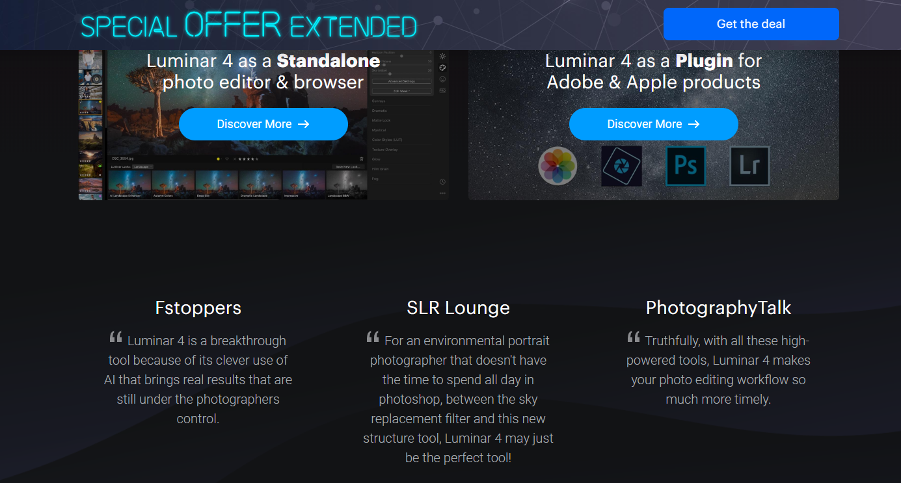

### Photoshop
    

> Creativity is everywhere.

由Adobe Systems开发和发行的图像处理软件，在桌面上编辑、合成和创建精美的图像、图形和艺术作品,简称“PS”，您的一生相伴。

**插件推荐：**

AI绘画插件：https://imagecreator.alkaidvision.com/

Kockout抠图插件：已过时于2017， 不推荐使用， 推荐使用Topaz Mask AI、Fluid Mask、Luminar AI

### Affinity Photo
   

由英国Serif公司研发的可以叫板PS的专业图像编辑软件PS软件。

### Lightroom
    

> The next page in layout design.

由Adobe开发和发行的以后期制作为重点的图形处理软件，让您可以创作精美绝伦的照片,在桌面上轻松整理所有照片，摄影工作必备，支持[`Windows` 、`macOS`、 `Android`、`iOS`]。

由Adobe Systems开发和发行的图像处理软件，在桌面上编辑、合成和创建精美的图像、图形和艺术作品,简称“PS”，您的一生相伴。

### Luminar
   

一个专业的图像处理软件以及一体化摄影照片管理应用。

### Aurora HDR
   

和Luminar一样，出自美国Skylum 公司的图像后期处理软件，可以说是世界上最先进的HDR照片编辑器。

### GIMP
   

一款开源的跨平台[`Windows` 、`macOS`、 `Linux`]图像编辑器。

### Paint.NET
   

> Paint.NET is image and photo editing software for PCs that run Windows.

一款小巧的PS替代工具。

 https://www.dotpdn.com/downloads/pdn.html

