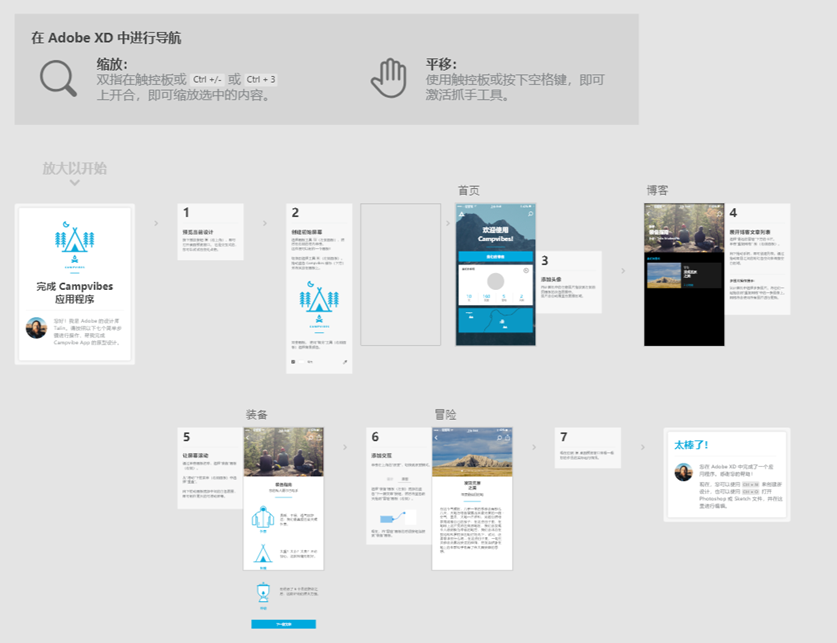

## Axure
  

美国Axure公司出品的最流行的快速原型设计工具，支持[`Windows` 、`macOS`]。

 https://www.axure.com/download

## Adobe XD
    

> The next page in layout design.

由Adobe开发和发行的交互原型设计软件。

## Sketch

MAC上的一款矢量绘图应用，只能在Mac中工作

Sketch：http://www.sketch.com/

## Principle

MAC上的一款交互原型设计软件。

https://principleformac.com/

## Figma

 

跨平台UI设计原型工具

**Figma插件：**

Locofy：https://www.locofy.ai/，I无代码工具将Figma、Adobe XD和Sketch设计转换成前端代码

Magician: Figma插件，AI生成图标、图片和UX文案, https://magician.design/

Jambot：Figma团队推出的Figma AI白板插件，可快速进行头脑风暴、思维导图生成等， https://www.figma.com/community/widget/1274481464484630971

## AI原型设计

Galileo AI：AI高保真原型设计， https://www.usegalileo.ai/

MasterGo AI：国产产品设计工具MasterGo推出的智能UI设计助手， https://mastergo.com/upcoming-ai/apply

墨刀AI: 墨刀推出的AI产品原型设计助手, https://modao.cc/feature/ai.html

Uizard: AI网页、App和UI设计, https://uizard.io/ai-design/