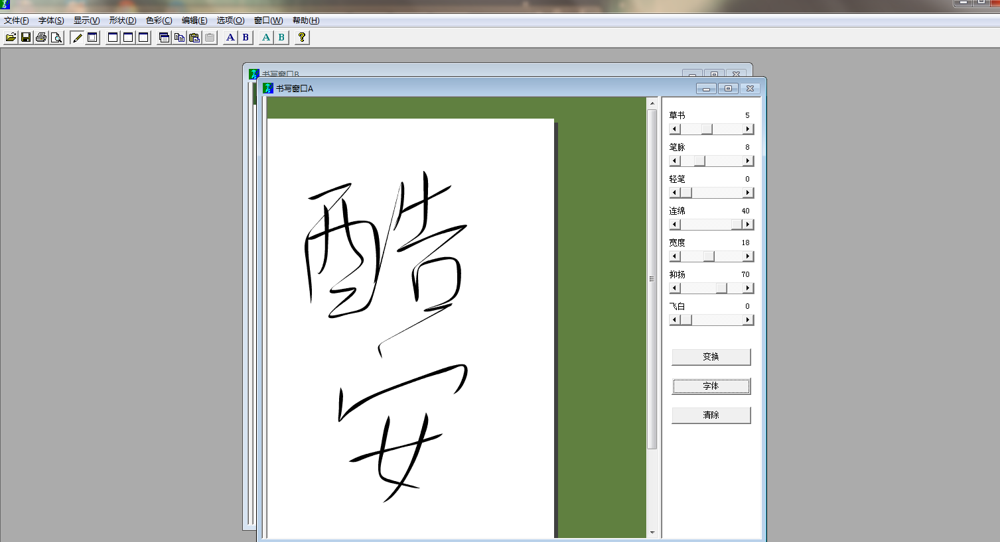

## HelloFont 字由

一站式字体管理、预览、备份与范例展示，可以快速在PPT、PS、AI等软件中找到你想要的字体。

<video width="720" controls>   <source src="https://resource.hellofont.cn/download/guide.mp4" type="video/mp4">  您的浏览器不支持Video标签。 </video>
## MacType
  

> Better font rendering for Windows.

使用简洁优雅的Mactype字体渲染，改善系统显示效果, 支持[`Windows` 、`macOS`]。

## Ougishi
 

神奇的毛笔字生成软件。

(心愿)： https://www.wishdown.com/soft/16114.html#a3

## Fontcreator

 一款专业的可用来制作字体(TTF)的专业字体设计软件。

 https://www.high-logic.com/font-editor/fontcreator