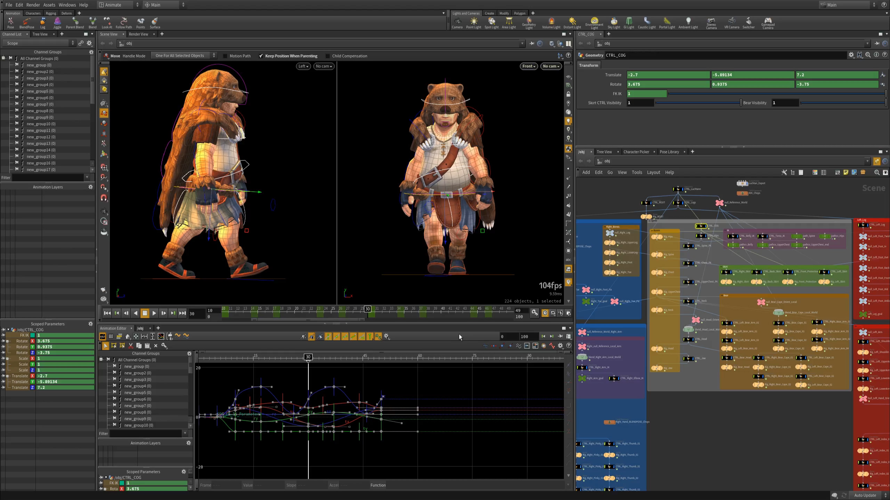

### After Effects     

> Cinematic visual effects and motion graphics. Make a big scene bigger.

Adobe出品的顶尖特效制作软件,俗称`AE`。

### HitFilm   

一款由英国FXhome公司开发的专业剪辑与后期特效合成软件，支持[`Windows` 、`macOS`]。

可用中文教程：http://www.videostar.com/brand/hitfilm/

### Houdini  

来自 Side Effects Software，常用于好莱坞大片，用于创作惊艳的视觉效果。

### Nuke   v

由The Foundry公司研发的强大视觉效果软件。
