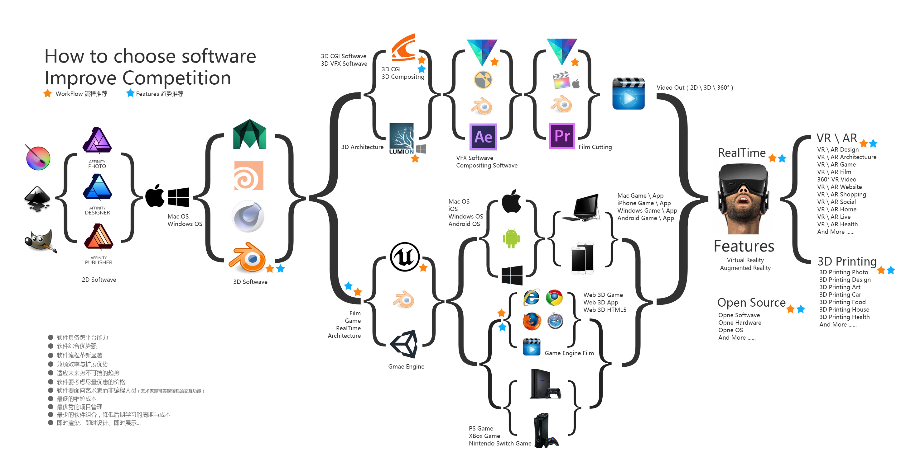

## Adobe

提起平面设计，不得不提的Adobe家族.

所有产品: https://www.adobe.com/creativecloud/catalog/desktop.html https://www.adobe.com/cn/creativecloud/catalog/desktop.html

PS：可使用 Creative Cloud 安装所有Adobe应用程序。
 [https://www.adobe.com/sea/creativecloud.html](https://www.adobe.com/sea/creativecloud.html)

## Autodesk

提起3d设计，不得不提的Autodesk(欧特克)家族.

所有产品: https://www.autodesk.com/products
https://www.autodesk.com.cn/products

