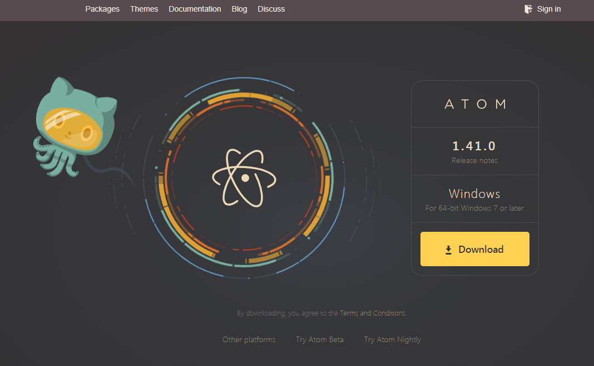
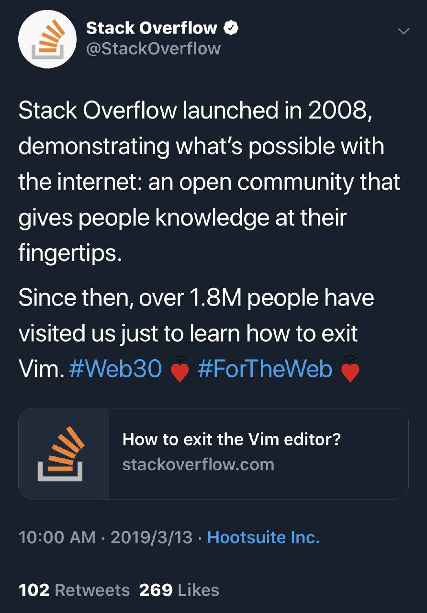

## Visual Studio Code

  

> VS Code is an integrated IDE which was developed by MICROSOFT, but its unlike the other Microsoft software like office and windows , its completely free and open source, and runs in different platforms.

插件地址： https://marketplace.visualstudio.com/
 https://code.visualstudio.com/docs#vscode

微软出品的更新维护频繁的超好用的开源文本编辑器。

## Sublime Text 3

  

最初设计为Vim提供多功能扩展，后发展为跨平台[`Windows` 、`macOS`、 `Linux`]的高度自定义轻量文本编辑器，支持插件扩展功能。

## Atom

 

跨平台的极客文本编辑器。

> Atom is a text editor that's modern, approachable, yet hackable to the core—a tool you can customize to do anything but also use productively without ever touching a config file.

## Emacs

Vim的竞争对手，类似于php是最好的语言。

- GNU Emacs : https://www.gnu.org/software/emacs/

## (G)Vim
 

即是Vi vi improved，Linux下最受欢迎的编辑器，被誉为编辑器之神，命令行操作。

## Neovim

被誉为vim真正的继任者。

## Brackets
 

由 Adobe 主导开发的一款开源的现代文本编辑器，主打HTML、CSS和JavaScript, 支持[`Windows` 、`macOS`、 `Linux`]。

## EditPlus
  

来自韩国的Notepad++替代品。

 https://www.editplus.com/download.html

## EverEdit
  

十分强悍的轻量文本编辑器。

中国版：http://cn.everedit.net/

 http://www.everedit.net/download

## Light Table
 

> Light Table is a next generation code editor that connects you to your creation with instant feedback.

一款开源的功能强大的代码编辑器。

## Notepad++
  

由台湾同胞开发的，开源的、支持多种编程语言的源码编辑软件。

> 开源软件政治化, 对作者倍感失望。

其他版本: Notepad2 mod/Notepad 3/Notepad nex

notepad--: https://github.com/cxasm/notepad-- (一个支持windows/linux/mac的文本编辑器，目标是做中国人自己的编辑器，来自中国。)

## CudaText

CudaText is a cross-platform text editor, written in Object Pascal. 

https://cudatext.github.io/

Github：https://github.com/Alexey-T/CudaText

## Geany

Geany is a powerful, stable and lightweight programmer's text editor that provides tons of useful features without bogging down your workflow. 

https://www.geany.org/

## Akelpad

AkelPad - is an open source editor for plain text. It is designed to be a small and fast. Features. Single window (SDI),

https://akelpad.sourceforge.net/en/index.php

## Emeditor
  

支持宏，Unicode，最好用的强大超大文件编辑器。

## NimbleText

 

> Manipulate text and data with light-weight patterns

小巧的大量文本处理软件。

桌面版: http://nimbletext.com/

在线版: http://nimbletext.com/Live

## 十六进制编辑器

### UltraEdit
   

一套功能强大的文本编辑器，可以编辑文本、十六进制、ASCII 码等。

### Winhex
   

一款与UltraEdit并驾齐驱的16进制文件编辑与磁盘编辑软件。

### Hex Editor

一款功能全面的文件编辑器工具,支持界面的选择,文件管理选项等等,允许自定义成最快捷的观看方式,打开压缩包的位置等, 支持手机版。

第三方下载链接: https://hexeditor.en.softonic.com/

### HXD Hex Editor

一款简单的十六进制编码处理软件。通过HxD最新版软件用户可以快速打开大容量的文件,还能够进行基本的十六进制编码处理操作。

