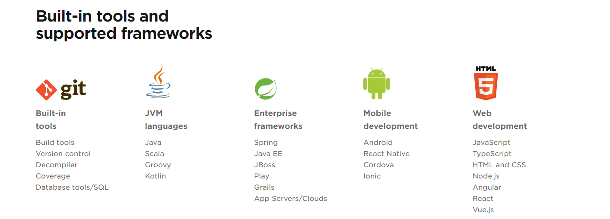
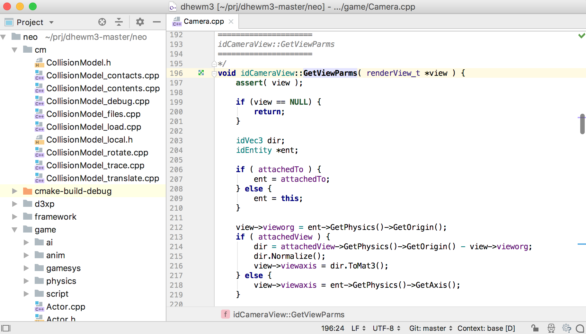

> So what is the most important thing to engage in the coding lifestyle?

Yes, **A computer** either running Windows, macOS, or Linux ( you can use phone / Tab also, though not convenient, e.g. *C4droid* *Termux*) and use a nice and powerful **software** would greatly improve your working efficiency.

And here I only listed the Windows Softwares I have used.

## Jetbains家族

## inteliJ IDEA
  

JetBrain出品，必属精品的跨平台[`Windows` 、`macOS`、 `Linux`]Java IDE，被公认为最好的java开发工具，由社区版可供免费下载与使用。

> ENJOY PRODUCTIVE JAVA

 https://www.jetbrains.com/idea/download/#section=windows

## WebStorm
 

JetBrain出品的WEB开发平台。

## CLion
  

> A cross-platform IDE for C and C++

JetBrain出品的跨平台[`Windows` 、`macOS`、 `Linux`]的IDE，支持C/C++开发，使用CMake构建。

## PyCharm
 

JetBrain出品的跨平台的Python开发平台，有社区版本（免费）

 Community For Win: https://www.jetbrains.com/pycharm/download/download-thanks.html?platform=windows&code=PCC

 Professional For Win:
https://www.jetbrains.com/pycharm/download/download-thanks.html?platform=windows

## Rider

  

> Fast & powerful, cross platform .NET IDE
> Develop .NET, ASP.NET, .NET Core, Xamarin or Unity applications on Windows, Mac, Linux

JetBrain出品的跨平台[`Windows` 、`macOS`、 `Linux`]的用于.NET/Mono开发的IDE.

 Resharper：http://www.jetbrains.com/resharper/

## AppCode
 

> Smart IDE for iOS/macOS development

JetBrain出品的IDE，用于iOS/macOS开发，支持`Objective-C, Swift, C and C++`，类似于Mac上的Xcode。

> 仅支持 MAC，但还是收录了。

## PhpStorm
  

JetBrain出品的跨平台[`Windows` 、`macOS`、 `Linux`]的PHP IDE。

## RubyMine
  

JetBrain出品的跨平台[`Windows` 、`macOS`、 `Linux`]的`Ruby`开发平台，支持多种框架。

## Visual Studio
    

微软出品的强大IDE，比较耗配置。

Visual Studio IntelliCode: https://visualstudio.microsoft.com/zh-hans/services/intellicode/, Visual Studio AI辅助开发

插件： http://vswebessentials.com/

Vassistx：https://www.wholetomato.com/

Coderush: https://www.devexpress.com/Products/CodeRush/

VB&C#：http://converter.telerik.com/

## Java IDE

Android Studio: https://developer.android.com/studio/index.html

> Android 的官方 IDE, 基于 IntelliJ 的 IDEA。

Eclipse:https://eclipse.org , Java的经典IDE，也支持Python编程。

>  https://eclipse.org/downloads/

NetBeans IDE: https://netbeans.org/,  Apache的一个免费开源的java IDE

## Dreamweaver

    

> Design and develop modern, responsive websites.

Adobe出品的强大易用的Web设计软件，在排版与可视化布局方面无与伦比。

> 如果注重实际运用，请慎用，参照 https://en.wikipedia.org/wiki/Tag_soup

## 国内IDE

**Hyper：**https://hyper.is/  https://github.com/zeit/hyper

基于electron的`HTML/CSS/JS`终端工具,支持[`Windows` 、`macOS`、 `Linux`]

**HBuilder：** http://dcloud.io/

国人开发的，由DCloud（数字天堂）推出的跨平台Web开发IDE。