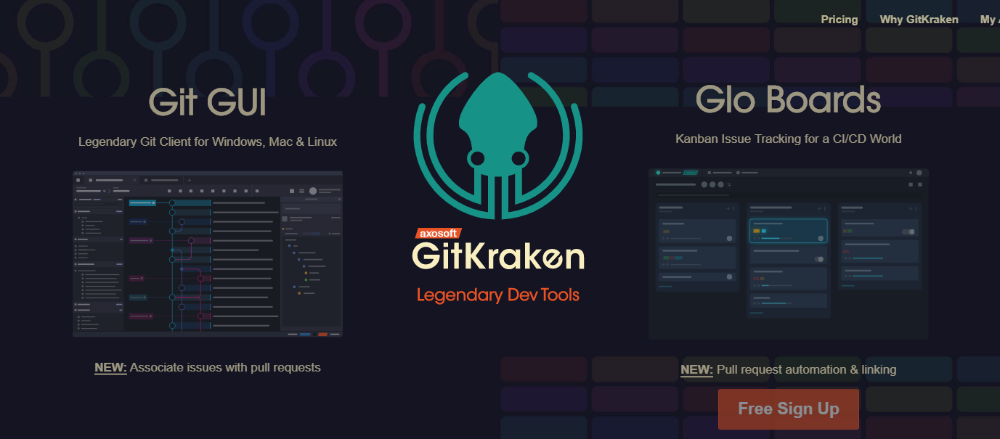

- **A version control system**, to manage files on servers, collaborate on a project with a team, share code and assets, and avoid editing conflicts. 

Learning GIT: https://learngitbranching.js.org/

  [GitHub](https://github.com/) code hosting service, based on [Git](http://git-scm.com/).

- **An automation system,** like [Grunt](http://gruntjs.com/) or [Gulp](http://gulpjs.com/) to automatically perform repetitive tasks, such as minifying code and running tests.

## SourceTree
 

> Simplicity and power in a beautiful Git GUI

一款免费的跨平台图形化GIT客户端。

## Git
  

 [https://git-scm.com/downloads](https://git-scm.com/downloads)

一款免费的跨平台[`Windows` 、`macOS`、 `Linux`]GIT客户端。

## GitKraken
 
优美的跨平台的 Git 客户端

## TortoiseGit
 

Windows Shell 下开源的海龟Git，也有SVN的兄弟TortoiseSVN 

## MGit
