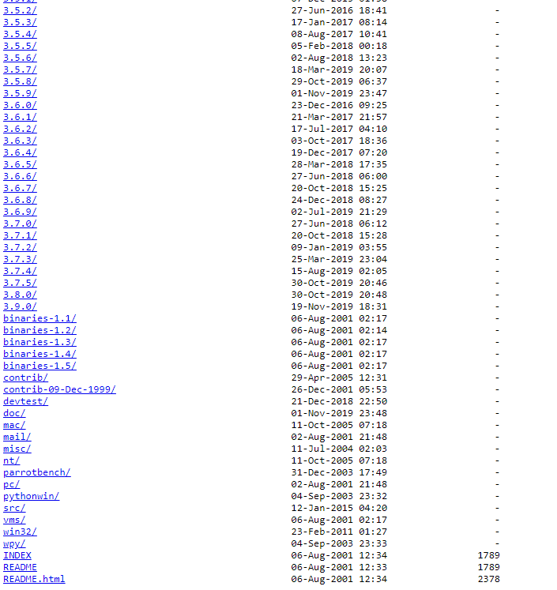

### Python  

> Python is powerful... and fast;
plays well with others;
runs everywhere;
is friendly & easy to learn;
is Open.

> 人生苦短,我用python.

 Win: https://www.python.org/downloads/windows/
 Mac: https://www.python.org/downloads/mac-osx/
 Linux: https://www.python.org/downloads/source/

 最新版：https://www.python.org/ftp/python/

 资源推荐

- Packages: https://pypi.python.org/pypi
- Awesome Python：https://github.com/vinta/awesome-python
- Awesome Python(Chinese)：https://github.com/jobbole/awesome-python-cn

- tesseract-ocr: [https://github.com/tesseract-ocr/tesseract](https://github.com/tesseract-ocr/tesseract)
- jupyter/JupyterLab : https://jupyter.org/

### Anaconda 

一个开源的Python发行版本。

* [https://www.anaconda.com/distribution/](https://www.anaconda.com/distribution/)

### PyCharm  

JetBrain出品的跨平台的Python开发平台，有社区版本（免费）

 Community For Win: https://www.jetbrains.com/pycharm/download/download-thanks.html?platform=windows&code=PCC

 Professional For Win:
https://www.jetbrains.com/pycharm/download/download-thanks.html?platform=windows

## 常用模块

- [openpyxl](https://openpyxl.readthedocs.io/en/stable/#)：处理excel表格
- python-docx：处理word文档
- 