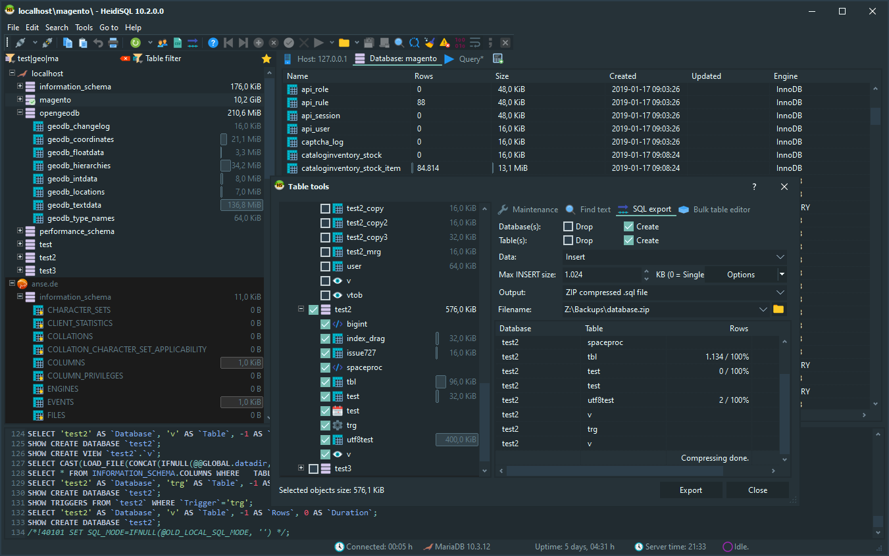

## Datagrip   

> Many databases, one tool

JetBrain出品的跨平台[`Windows` 、`macOS`、 `Linux`]的数据库管理工具。

##  DB Browser for SQLite  

一个小巧强大的`SQLite`的开源数据库工具。

 http://www.sqlitebrowser.org/dl/ 

## HeidiSQL  

一款支持MySQL, MariaDB, Mircosoft SQL Server 和 PostgreSQL 的开源数据库管理工具。

 https://www.heidisql.com/download.php

##  Keylord   

> Keylord is a desktop GUI client for Redis, Memcached, RocksDB, Bolt and LevelDB key-value databases. It is also known as "Redis GUI" or "Redis Client". It helps developers, dev-ops and system administrators quickly view content of key-value databases and simplify typical routine operations related to them.

一款支持Redis, Memcached, RocksDB, Bolt等的跨平台[`Windows` 、`macOS`、 `Linux`]数据库客户端。

 https://protonail.com/keylord/download

##  Sql Wave 

> Create, administer, query, diagram and explore MySQL, MariaDB, PostgreSQL, MS SQL Server, Valentina DB and SQLite. Now with Valentina Forms

MySQL图形化编辑工具。

##  SSLyog 

> Agentless and Cost-Effective MySQL Client
Tools for Managing and Monitoring Performance

一款专业的 MySQL图形化管理工具。

##  RazorSQL 

一款强大的数据库查询工具、SQL的编辑、数据库管理工具

##  Redis Desktop Manager   

跨平台的开源Redis数据库管理工具。

##  Robo 3T 

一款轻量级的MongoDB管理工具。

 https://robomongo.org/download