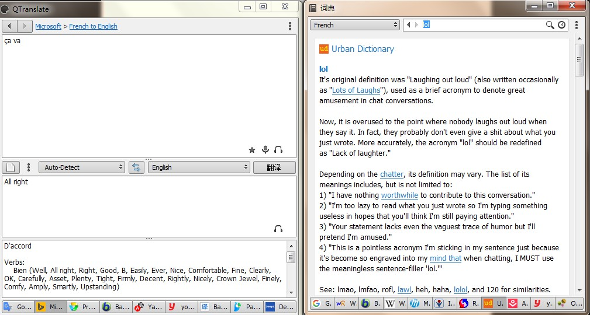

### DeepL      

由大名鼎鼎DeepL开发的桌面端翻译神器。

Win & Mac: https://www.deepl.com/app/

### QTranslate      

 https://quest-app.appspot.com/download

Windows下强大的免费翻译工具，支持的翻译引擎：

- [Babylon](http://translation.babylon-software.com/)
- [Baidu](http://fanyi.baidu.com/)
- [DeepL](https://www.deepl.com/translate)
- [Google](https://translate.google.com/)
- [Microsoft](https://www.bing.com/translator)
- [Naver](http://translate.naver.com/)
- [Promt](http://www.online-translator.com/)
- [Yandex](https://translate.yandex.com/)
- [youdao](http://fanyi.youdao.com/)

### Poedit        

> Powerful and intuitive translation editor

一款python开发的翻译`po`文件的工具，支持[`Windows` 、`macOS`、 `Linux`]

### Dango-Translator    

团子翻译器 —— 个人兴趣制作的一款基于OCR技术的翻译器

