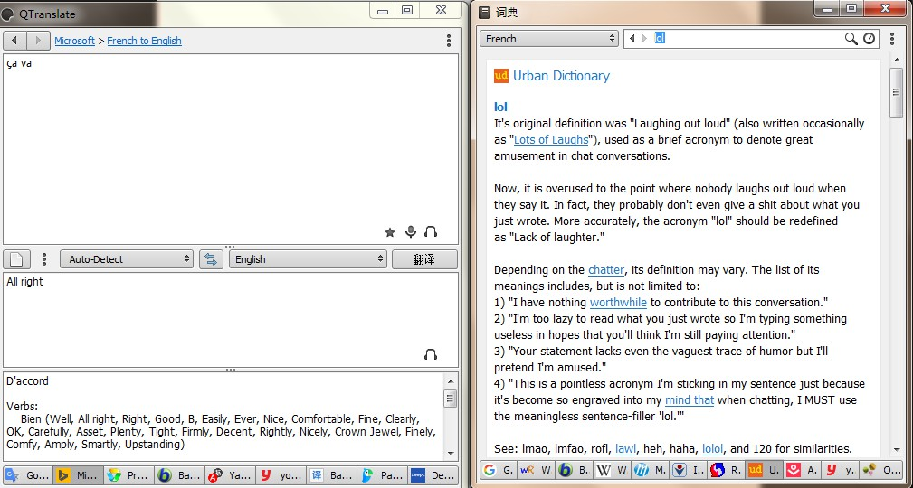
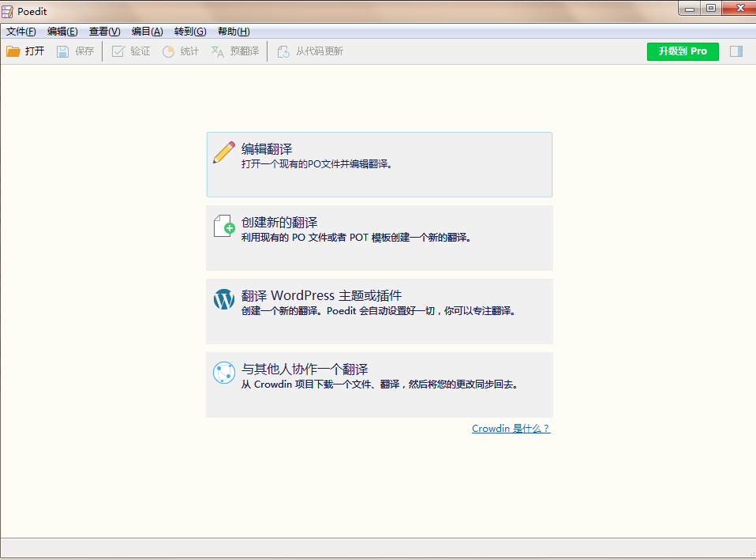
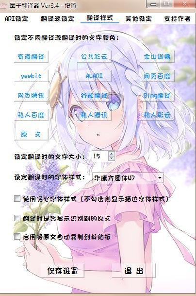

## Google

谷歌翻译：https://translate.google.com/

> 2022.9 谷歌翻译已停止在中国大陆地区提供服务，需用工具访问

## DeepL
      

官方网站：https://www.deepl.com/

网页版：https://www.deepl.com/translator

DeepL Write：https://www.deepl.com/write  (润色和智能修改工具)

由大名鼎鼎DeepL开发的桌面端翻译神器。

Win & Mac: https://www.deepl.com/app/

## Bing

https://www.bing.com/translator/ 

[Microsoft-Bing翻译](https://www.bing.com/translator)

## 彩云小译

https://fanyi.caiyunapp.com/

APP下载：https://fanyi.caiyunapp.com/#/app

## 翻译软件

### QTranslate
   

> 官网：https://quest-app.appspot.com， 更新疑似停止维护

 https://quest-app.appspot.com/download

Windows下强大的免费翻译小巧工具，界面清爽无广告，支持取词翻译、图片OCR翻译(需申请OCR API Key，申请地址：https://eepurl.com/bOLOcf）、支持添加词典等, 集成了最常见的九款翻译引擎，中文翻译引擎集成了Google、微软、百度、有道等。

### Poedit  
      

> Powerful and intuitive translation editor

一款python开发的翻译`po`文件的工具，支持[`Windows` 、`macOS`、 `Linux`]

### Dango-Translator
    

团子翻译器 —— 个人兴趣制作的一款基于OCR技术的翻译器

### CopyTranslator

CopyTranslator：复制即翻译的外文辅助阅读翻译解决方案，阅读文献配合使用的好帮手

Github：https://copytranslator.github.io/

下载安装： https://copytranslator.github.io/download/

### Xtranslator

文档地址：https://www.yuque.com/xtranslator/help

Xtranslator：https://www.nexusmods.com/skyrimspecialedition/mods/134

XTranslate：https://chrome.google.com/webstore/detail/xtranslate/gfgpkepllngchpmcippidfhmbhlljhoo

### 知云文献翻译

支持网页、pdf word、.caj等多翻译引藥切换，支持中英互译特有学术引擎优化质量好！

https://www.zhiyunwenxian.cn/

## AI翻译工具

象寄翻译：https://www.xiangjifanyi.com/home/

> 支持中英日韩欧美东南亚等多国语言，便捷的图片/短视频精修工具，支持API调用，轻松打造精品出海内容素材

网易见外: AI智能翻译平台，支持音视频、文档、图片、字幕等翻译

https://sight.youdao.com/

阿里翻译: https://translate.alibaba.com/

火山翻译: https://translate.volcengine.com/

TranSmart：腾讯AI Lab推出的一款AI辅助翻译产品

https://transmart.qq.com/zh-CN/index

讯飞智能翻译：https://fanyi.xfyun.cn/console/trans/text

百度AI同传助手：https://fanyi.baidu.com/appdownload/download.html

## 在线翻译工具

中文翻译工具：
- [Baidu](http://fanyi.baidu.com/)
- [有道翻译-youdao](http://fanyi.youdao.com/)
- 腾讯翻译君：https://fanyi.qq.com/
- 搜狗翻译：https://fanyi.sogou.com/text
- 金山快译：https://kuaiyi.wps.cn/txt-translate
- https://www.1sj.tv/ 人人译视界

其他翻译工具：

- [Babylon](http://translation.babylon-software.com/)
- [Naver](http://translate.naver.com/)，另有一款papago，是由韩国naver公司研究开发的手机中韩语言翻译软件
- [Promt](http://www.online-translator.com/)
- [Yandex](https://translate.yandex.com/)

----

其他在其他章节已收录：

沙拉查词-聚合词典划词翻译

词典软件