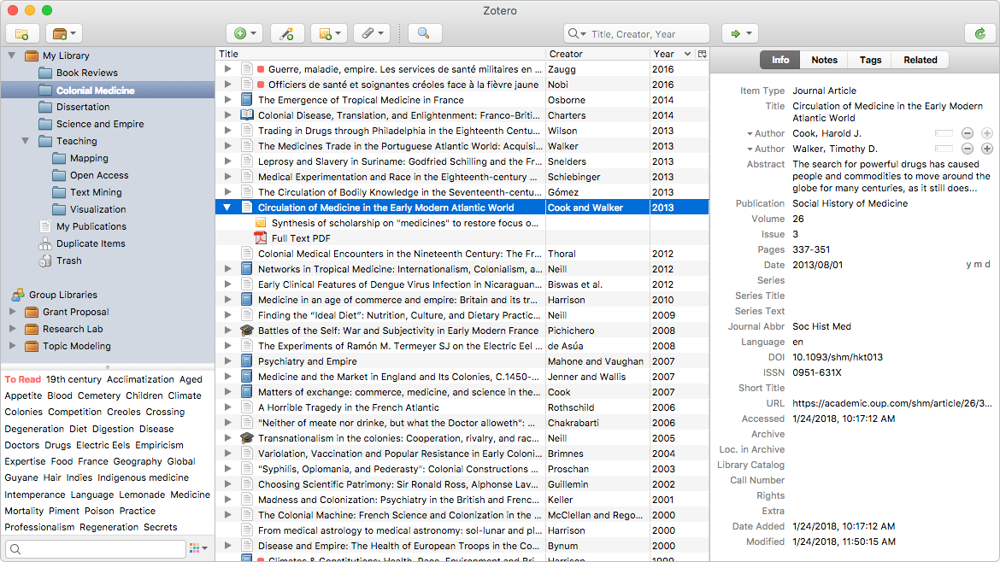

## Zotero 

 

> Zotero is a free, easy-to-use tool to help you
collect, organize, cite, and share research.

与EndNote相媲美的开源文献管理器，支持WebDAV，支持[`Windows` 、`macOS`、 `Linux`]。

 https://www.zotero.org/download/

## Endnote

  

> Research Smarter

一款专业的文献管理软件,大量用于科研学术领域，可快速管理文献引用。

## NoteExpress

 

一款由北京爱琴海软件公司开发的专业级别的文献检索与管理系统，其核心功能涵盖“知识采集，管理，应用，挖掘”的知识管理的所有环节，是学术研究，知识管理的必备工具，发表论文的好帮手。

## Mendeley 

 

> Mendeley brings your research to life, so you can make an impact on tomorrow

德国开发的一款免费跨平台[`Windows` 、`macOS`、 `Linux`、 `Android`、`iOS`]文献管理软件，可以注释和高亮显示 PDF，也有限额的免费云存储。

## Citavi 

   

> 一款专业的文献参考检索与管理软件,它整合了知识管理、任务计划等功能,在科研工作中堪称学术界中的瑞士军刀。

从德国杜塞尔多夫大学研发的文献管理软件，在德语国家非常流行，也支持英语以及中文(https://www.softhead-citavi.com/), 目前只有Win版且有免费版本可供下载。

