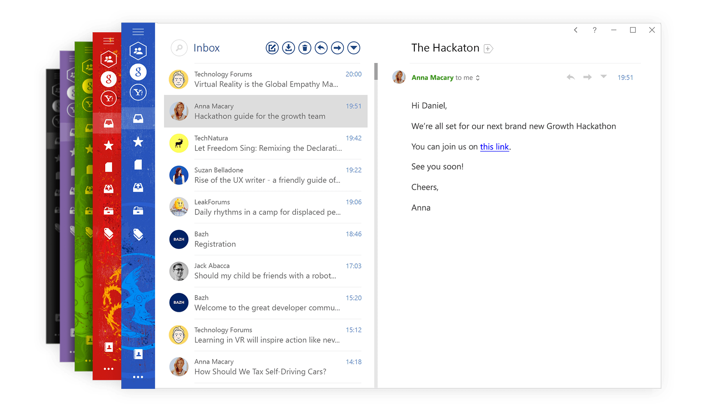
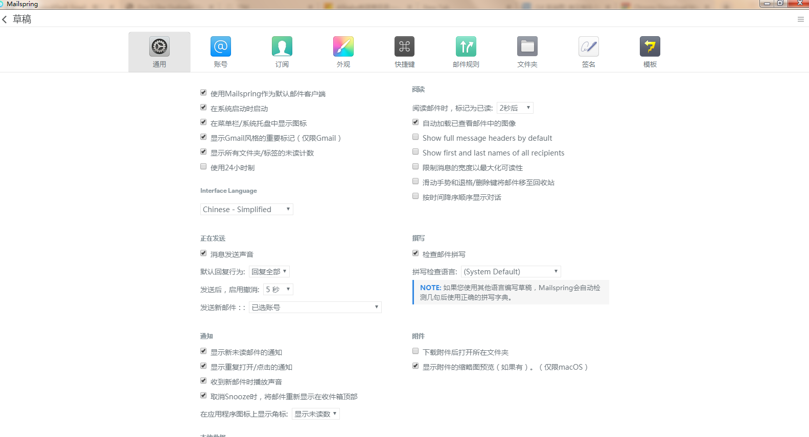
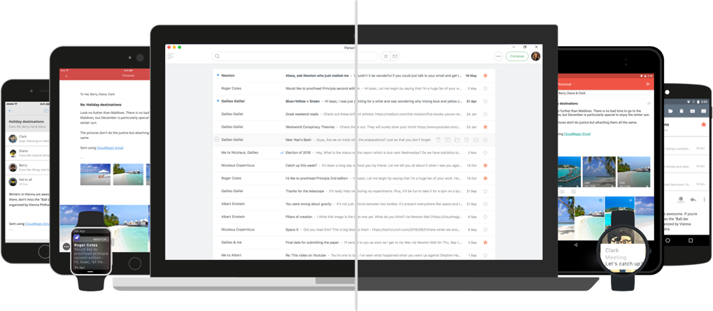

## Foxmail
 

从 1997 年就有的邮件客户端， 现属于腾讯的中文邮件客户端,界面比较简洁与传统，支持win和Mac，与qq、gmail邮箱相容性不错。

## Mailbird
   

> We strive to make your email experience fly

界面简洁漂亮，支持whatsapp，wechat，facebook等插件，支持触摸，可惜的是, 免费版只能用一个邮箱地址

 [https://www.getmailbird.com/](https://www.getmailbird.com/)

## Mailspring
  

Mailspring是`Nylas N1`的分支版本，有付费版本，界面简洁美观，原来的Nylas已经停止维护。

支持 [`Windows` 、`macOS`、 `Linux`]

[https://getmailspring.com/](https://getmailspring.com/)

## Newton
 

跨平台，支持[`Windows` 、`macOS`、`Android`、`iOS`]，界面统一、简洁、美观。

> Email app with space-age features for modern-day business communication.

> Designed to delight, for all your email accounts, on all your devices

## Postbox
 

> Simple, Clear and Powerful With Beautiful UI

简洁而优雅的邮件客户端，支持[`Windows` 、`macOS`]

 https://www.postbox-inc.com/download

## Thunderbird
  

雷鸟，老牌的免费开源电子邮件客户端，配置简单，界面一般，出自 Mozilla，支持[`Windows` 、`macOS`、 `Linux`]。

## Outlook
 

强大的Microsoft Office 组件之一，邮件、联系、整理、完成工作，支持[`Windows` 、 `Android`]。

## 网易邮箱大师

> 心无旁骛，专注办公
> 网易邮箱大师 专业的全平台邮箱客户端

网易出品的跨平台邮件 ，支持[`Windows` 、`macOS`、 `Android`、`iOS`]，以前叫网易闪电邮。

---

 如果用第三方邮箱客户端绑定流氓的网易邮箱，会提醒这个，"网易邮箱提醒：一次被阻止的收信行为"，如果这样的话，记得更改这个：
>
>[http://config.mail.163.com/settings/imap/login.jsp?uid=yourusername@126.com](http://config.mail.163.com/settings/imap/login.jsp?uid=sunnysky123@126.com)

## DreamMail
 

强悍、纯净、稳定的邮件客户端，以及vuepress的帮助文档，十分便捷。

 http://help.cy-email.com/

## 已关闭邮件客户端

### Yomail
 

优雅简洁高效的邮箱客户端，疑似公司跑路，停止维护

[http://www.nextechat.com/](http://www.nextechat.com/)

