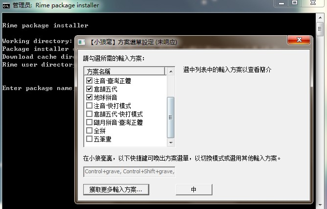

## 搜狗输入法

支持大量精美皮肤，略带广告，深入人心的跨平台[`Windows` 、`macOS`、 `Linux`、 `Android`、`iOS`]中文输入法。

 Linux： https://pinyin.sogou.com/linux/

## QQ 输入法
 

来自腾讯，支持Win和Android的，一直在维护更新的良心输入法。

## 百度输入法

> 初见如故，再见有您

百度出品的跨平台[`Windows` 、`macOS`、`Android`、`iOS`]的中文输入法。

## 讯飞输入法

由科大讯飞开发的一款集语音、手写、拼音等输入方式于一体的中文输入法，主推语音识别输入，支持四川话、闽南语等23种方言。

跨平台支持[`Windows` 、`macOS`、`Android`、`iOS`]

## 手心输入法
  

一款高效,无广告,只专注于输入本质的纯粹输入法，跨平台支持[`Windows` 、`macOS`、 `Android`、`iOS`], 已于2018年停止更新。

win版： http://www.xinshuru.com/index.html?p=win

## 必应输入法

由微软出品的创新中文输入法，轻盈流畅，无广告，无插件，已停止开发 。

## 谷歌输入法

挺好用的输入法，被Google遗弃了。

## Swiftkey

现为Microsoft Swiftkey

https://www.microsoft.com/en-us/swiftkey

## RIME 小狼毫

  

> 聪明的输入法懂我心意

[RIME | 中州韻輸入法引擎](https://rime.im/)：基于中州韵输入法引擎的小巧简洁的跨平台(`Windows` 、`macOS`、 `Linux`、 `Android[同文]`)开源可扩展自定义的中文+繁体输入法。

 https://rime.im/download/

## 落格输入法

落格输入法 是 macOS 和 iOS 平台进行中文输入的绝佳选择。不论你使用的是全拼、双拼还是五笔，是郑码、兮码还是快笔，你都可以在落格输入法中继续输入。

官网https://im.logcg.com/ 

落格智聊 CHAT-AI， 支持全平台下载：https://im.logcg.com/chat-ai  / https://www.chatai.lol/