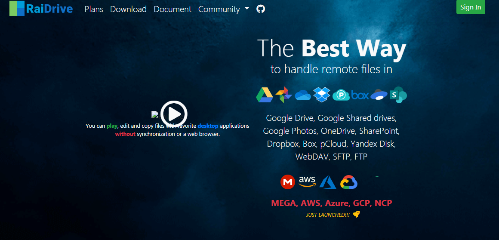

> 备份存储你的一切。

## 国内网盘服务

### 百度网盘

由百度公司开发的跨平台[`Windows` 、`macOS`、 `Linux`、 `Android`、`iOS`]运行的国民级资源分享与在线存储平台。

> 第三方下载例如[PANDOWNLOAD](http://pandownload.com/)、 [SpeedPan](https://www.speedpan.com/)已基本失效, 官方可使用开启利用闲置带宽优化下载速率加快下载速率

  http://pan.baidu.com/download

云一朵：https://pan.baidu.com/aipan/welcome

万能联播:  http://app.iqiyi.com/pc/wnplayer/help.html, 爱奇艺合作下载， 目前已限速

百度网盘青春版:  无限速但只能导入三次

每月一天网盘VIP: https://pan.baidu.com/component/view?id=2002&1=1

baiduwp-php:  https://github.com/yuantuo666/baiduwp-php (A tool to get the download link of the Baidu netdisk / 一个获取百度网盘分享链接下载地址的工具)

### 夸克

https://www.quark.cn/

配合淘宝88vip，6T超大空间，超速下载，也可支持磁力链下载。

### 微云

> 微云是腾讯公司为用户精心打造的一项智能云服务, 您可以通过微云方便地在手机和电脑之间,同步文件、推送照片和传输数据。

支持[`Windows` 、`macOS`、 `Android`、`iOS`]

 https://www.weiyun.com/download.html

### 阿里云

阿里出品的一款大容量、不限速、不打扰、够安全、易于分享的网盘，你可以在这里存储、管理和探索内容，尽情打造丰富的数字世界, 支持[`web`、`Windows` 、 `Android`、`iOS`]。

https://www.aliyundrive.com/download

阿里旗下还有：

- 夸克网盘: [【夸克网盘】PC网页版端入口 (quark.cn)](https://pan.quark.cn/)
- UC网盘: https://drive.uc.cn/

### 坚果云

 https://www.jianguoyun.com/

一款便捷、安全的专业的跨平台低调网盘产品，支持[`Windows` 、`macOS`、 `Linux`、 `Android`、`iOS`]，支持`WebDAV`，ta就像书房一样，陪伴你左右。

### 123云盘

专注于大文件传输分享的网盘，让你可以不限速、不限容量地存储和分享文件。

https://www.123pan.com/

### 天翼云盘

由中国电信出品的良心网盘，在登录情况下，可以不用客户端直接下载，比如使用IDM进行下载，跨平台支持[`Windows` 、`macOS`、 `TV`、 `Android`、`iOS`]。

 https://cloud.189.cn/template/download-client/index.html

类似的还有移动的**和彩云**：https://yun.139.com/

### 蓝奏云

免费的云盘存储，主要用作软件，分享平台，用户体验极佳, 仅支持web, 暂不支持客户端。

### 其他网盘

飞猫盘: https://www.feimaoyun.com/ (上线10年老品牌 iOS、Android、Win、Mac全平台客户端)

微盘（微博网盘），疑似停止跟新 : http://vdisk.weibo.com/

## 国外网盘服务

### OneDrive

 

[https://office.live.com/start/onedrive.aspx?omkt=en-us](https://office.live.com/start/onedrive.aspx?omkt=en-us)

 https://onedrive.live.com/about/en-us/download/

微软提供的最佳云存储解决方案，支持[`Windows` 、`macOS`、 `XBOX`、 `Android`、`iOS`]。

### Box

简洁优雅的国外网盘，遵循[GDPR](https://www.box.com/gdpr)标准。

### Dropbox
 

国外流行著名的简单，优雅的同步、备份、共享云存储软件，支持[`Windows` 、`macOS`、 `Android`、`iOS`]， 支持匿名分享。

### Google Drive
 

Google生态系统的云存储解决方案。

Download a large file from Google Drive (curl/wget fails because of the security notice)： https://github.com/wkentaro/gdown

### Mega
 

国外安全、可靠、稳定的大容量存储服务商，支持[`Windows` 、`macOS`、 `Linux`、 `Android`、`iOS`]，以前可直接访问，拥有众多良心资源，可用MEGA Link Downloade工具下载资源。

### Mediafire

来自美国华盛顿的老牌免费网络硬盘，支持[ `Android`、`iOS`]。

### Yandex Drive

俄罗斯yandex出品的免费良心网盘。

### pikpak

来自新加坡的极速无限制全能网盘, 可以通过磁力链接或者PikPak特征码秒离线下载和播放网络视频，并支持Telegram，可以向机器人发送资源、即可实现下载。跨平台支持Windows, Android, iPhone, iPad等操作系统！

> 国内不可用，禁大陆IP

官网: https://mypikpak.com/

## 网盘挂载映射

### Raidrive

将网络网盘映射为本地磁盘，同时支持`webdav`、`FTP`、`SFTP`。

  https://www.raidrive.com/Download

### NetDrive

一个基于WebDrive技术的驱动器映射工具，让你可以像访问本地文件一样访问你的云存储，支持多种云服务，如Dropbox, Google Drive, OneDrive, Box, S3, WebDAV, FTP等。

https://www.netdrive.net/

### alist

🗂️A file list/WebDAV program that supports multiple storages, powered by Gin and Solidjs. / 一个支持多存储的文件列表/WebDAV程序，使用 Gin 和 Solidjs。

将你的云存储挂载为本地驱动器获将本地驱动器映射为云存储，支持多种云服务，如阿里云盘、OneDrive、Google Drive等, 同时支持WebDAV协议，跨平台支持[`Windows` 、`macOS`、 `Linux`]。

Github: https://github.com/alist-org/alist

### CloudDrive

一个可以将多个云存储服务挂载为本地驱动器的软件，支持多种云服务，如阿里云盘、百度网盘、115网盘、天翼云盘、PikPak、WebDAV等， 跨平台支持Windows, Linux, macOS, Android, LibreElec, CoreElec, OpenWRT等操作系统。

https://www.clouddrive2.com/

## 手机云服务

iCloud，华为云，小米云等

## 已关闭的服务
- [Hubic](https://hubic.com/): 停止注册
- 360个人版, 自360云盘关闭事件后，仅提供企业版: https://www.fangcloud.com/ (360亿方云)
- [关于 Pandownload 和百度网盘，你想知道的都在这里了](https://zhuanlan.zhihu.com/p/135888532)