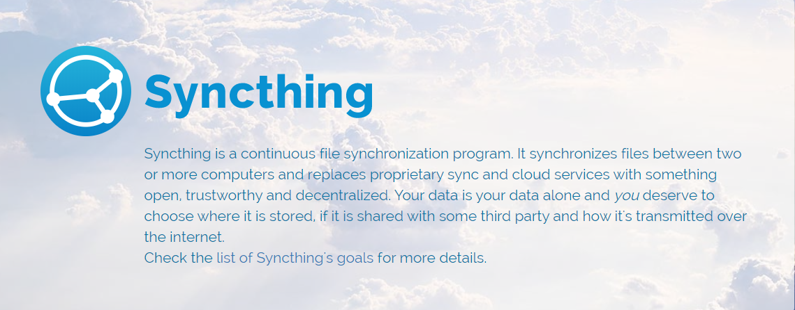
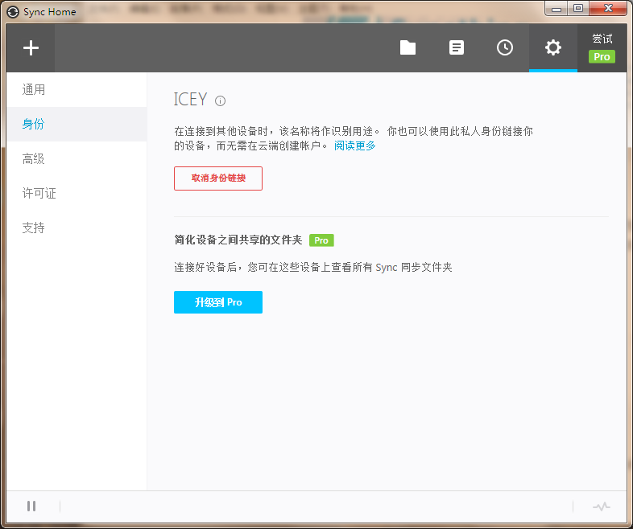
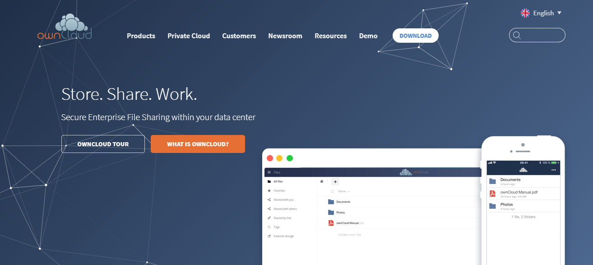
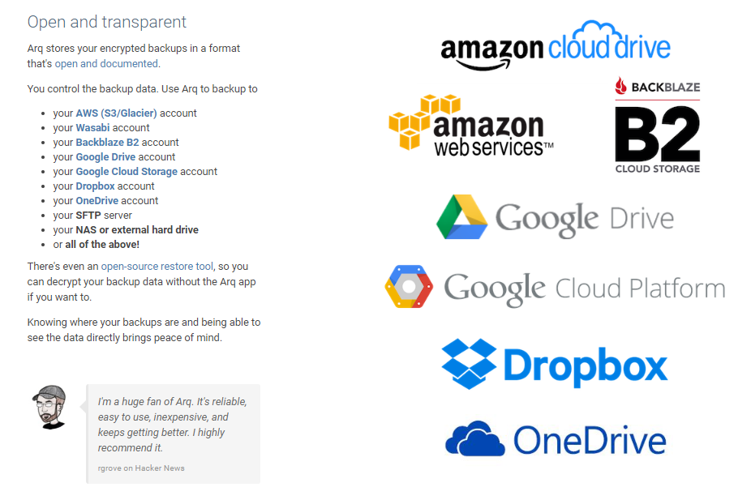

## Syncthing
    

不依赖云服务器的跨平台[`Windows` 、`macOS`、 `Linux`、 `Android`]，可在多台计算机之间简单安全地同步文件。

 [https://github.com/syncthing/syncthing/releases](https://github.com/syncthing/syncthing/releases)

## Resilio sync
     

由 BitTorrent 公司开发的专有的对等网络数据同步工具, 跨平台[`Windows` 、`macOS`、 `Linux`、 `Android`、`iOS`]，一般用来输入神KEY同步资源。

## 微力同步
   

一款颠覆性的免费跨平台类似于Resilio sync的国产多平台文件同步软件，不需要第三方服务器即可让多台电脑之间直接互相同步和共享文件，而且全程 AES 加密，支持内网穿透 P2P 传输，同时支持 AES 加密处理。

 [http://www.verysync.com/download.html](http://www.verysync.com/download.html)

## Seafile
 

开源的跨平台[`Windows` 、`macOS`、 `Linux`、 `Android`、`iOS`]企业云盘，注重可靠性和性能。

 https://www.seafile.com/download/

## NextCloud

自由及开源的网盘，支持WebDAV，支持[`Windows` 、`macOS`、 `Linux`、 `Android`、`iOS`]进行同步。

 https://nextcloud.com/install/#

## OwnCloud

`Store. Share. Work.`

Secure Enterprise File Sharing within your data center

一个开源的私有云盘解决方案，支持[`Windows` 、`macOS`、 `Linux`、 `Android`、`iOS`]同步，app是收费的。

## Arq
 

备份文件到以下云端账户，支持[`Windows` 、`macOS`]。

## Bvckup 2

轻而小的数据同步复制软件。

## Duplicati
  

> Store securely encrypted backups in the cloud!

免费开源的跨平台[`Windows` 、`macOS`、 `Linux`]备份应用，支持同步本地存储，云存储服务和远程文件服务器。

## FreeFileSync
 

免费的、开源的文件夹比较和同步软件，双向同步备份重要资料。

## FileGee
 
一款优秀的企业文件同步备份系统,集文件备份、同步、加密、分割于一身。功能强大,有效提高工作效率, 免费版个人使用足矣。

## SyncBackFree

Backup software for Windows 

https://www.2brightsparks.com/download-syncbackfree.html

## SyncTrayzor

Windows tray utility / filesystem watcher / launcher for Syncthing

上次更新于2021

Github: https://github.com/canton7/SyncTrayzor

## 手机端同步

- [Dropsync](https://play.google.com/store/apps/details?id=com.ttxapps.dropsync)
- [FolderSync](https://play.google.com/store/apps/details?id=dk.tacit.android.foldersync.lite)

## Tonido

 

打造私人硬盘服务器，存取/分享你的本地文件, 支持[`Windows` 、`macOS`、 `Linux`、 `Android`、`iOS`、`Web`、`Windows Phone`]

> The Sun Sets on Tonido
> 14 years ago, we set out to create the first personal cloud platform with a mission of keeping your data truly yours: Tonido.
>
> Your feedback, support, and continued encouragement shaped Tonido's development. Over the years, we expanded capabilities with solutions like TonidoPlug, a "cloud-in-a-plug" NAS for small businesses. We offered unlimited storage, powerful data security, and ease-of-access from anywhere and any device.
>
> Eventually, Tonido grew into a full-fledged, enterprise-class solution we named FileCloud, a hyper-secure, compliance-friendly file sharing and sync platform that serves thousands of enterprises and millions of customers around the globe.
>
> Tonido was a labor of love that enabled us to grow as a team, to challenge our skills, and to discover new insights and possibilities. After all these years and an exceptional journey, it is a a difficult moment for us to say that Tonido's story ends here.
>
> Tonido software and web access will continue to work in your LAN. However, we recommend switching to FileCloud community edition and setting up dynamic port forwarding to access data from your storage going forward.
>
> Thank you for being part of our journey!
>
> The Tonido Team
> 2008-2022

 https://www.tonido.com/tonidodesktop_downloads/

FILECOULD(商业化版本): https://www.filecloud.com/

