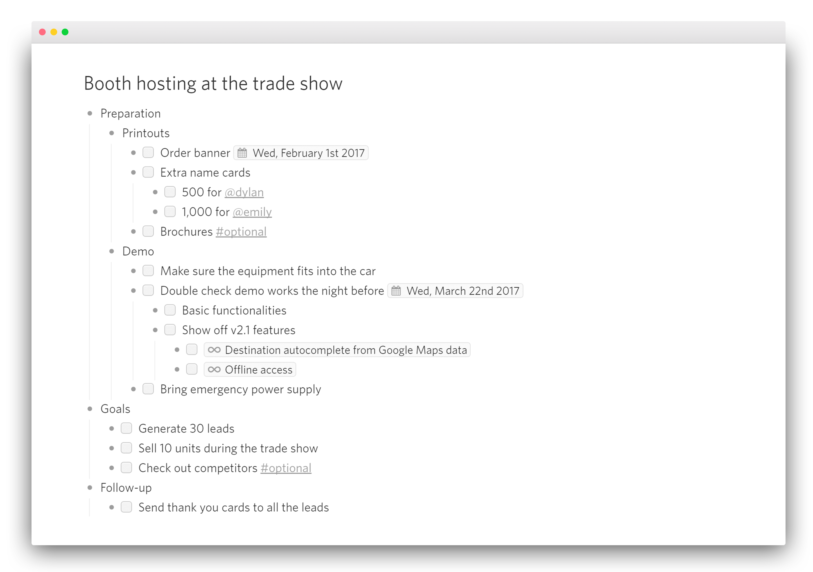

### Dynalist {#Dynalist} 

> The best outlining app for your best work
Where brilliant ideas are captured, fleshed out, and realized.

一款类似workflowy以及mac上Cloud Outliner Pro的大纲笔记软件。

 https://dynalist.io/download

### Mubu {#Mubu} 

> 幕布，不只是大纲笔记，更是一种思考方式

一款极简的大纲笔记应用，也可以一键生成思维导图，平台支持如下，

 https://mubu.com/apps

### WorkFlowy {#WorkFlowy} 

大纲笔记软件鼻祖，支持[`Windows` 、`macOS`、 `Linux`、 `Android`、`iOS`]

桌面版下载：https://workflowy.com/downloads/windows/