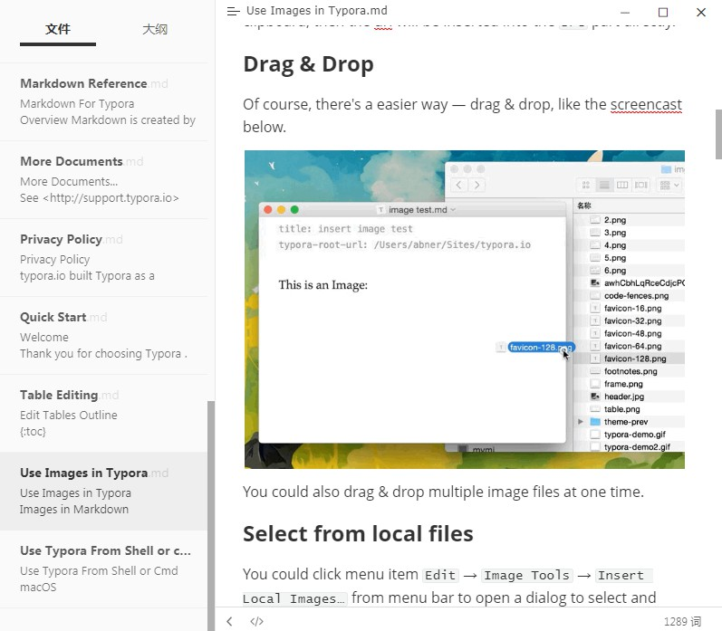

### Typora   {#Typora}

来自韩国更新频繁的超Nice的跨平台[`Windows` 、`macOS`、 `Linux`]本地Markdown编辑写作工具，WYSIWYG(所见即所得)。

最新免费版本为0.11.18，1.00版本后开始收费，价格为14.99$。

快捷键： https://support.typora.io/Shortcut-Keys/

### Markdown Plus  

跨平台[`Windows` 、`macOS`、 `Linux`、 `Android`、`iOS`]的Markdown 编辑器，支持通用 markdown、GitHub markdown 之外，还支持：实时预览代码、高亮任务列表、Emoji 图标、Font Awesome 图标、Ionicons 图标、数学公式、流程图、顺序图、甘特图

### Inkdrop 

> Organizing your Markdown notes made simple.
Jot down your daily hacking endeavors and increase your productivity.

Markdown爱好者的笔记应用程序，60天试用，支持丰富的扩展插件。

 ### Yu Writer  

 由国人开发的跨平台[`Windows` 、`macOS`]markdown写作软件，支持版本回溯、多格式导出等功能。
