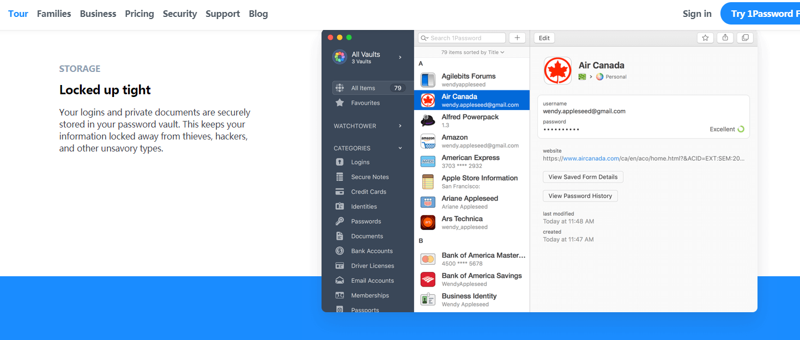
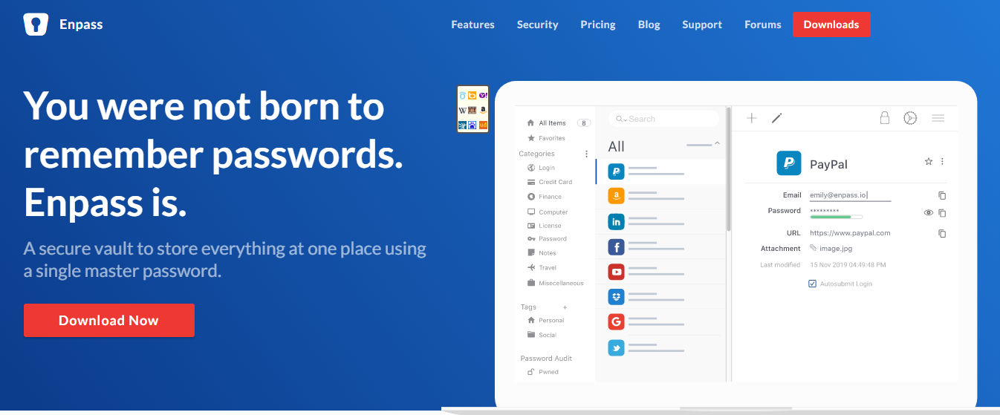
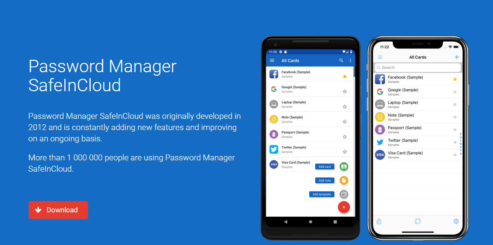
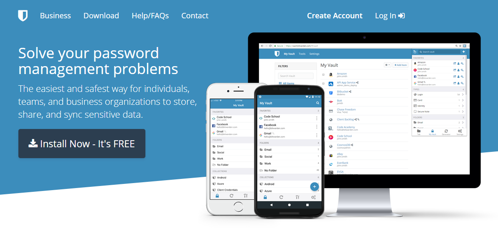
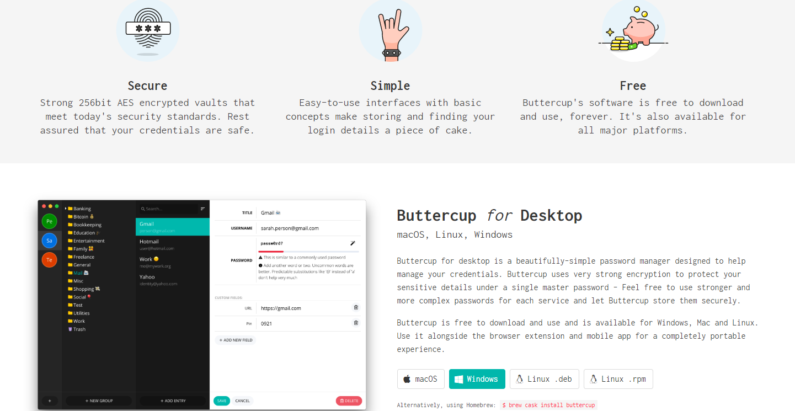

## KeePass
  

免费、开源、易用的老牌密码管理软件，界面比较简陋，支持[`Windows` 、`macOS`、 `Linux`、 `Android`、`iOS`].

 https://keepass.info/download.html
## 1Password
 

一款跨平台的电脑手机账号密码管理工具软件，界面美观，UI舒服，功能齐全，支持[`Windows` 、`macOS`、 `Android`、`iOS`]。

## Enpass
 

一款简洁优雅的密码管理软件，支持[`Windows` 、`macOS`、 `Linux`、 `Android`、`iOS`]。

 https://www.enpass.io/downloads/

## Safeincloud
 

一款安全方便的密码管理产品，支持[`Windows` 、`macOS`、 `Linux`、 `Android`、`iOS`、`Chrome`]。

 http://www.safe-in-cloud.com/en/#download

## Roboform
 

一款网页填写和密码管理工具，支持[`Windows` 、`macOS`、 `Linux`、 `Android`、`iOS`]。

 https://www.roboform.com/download

## Lastpass
 

> Simplify your life.
LastPass remembers all your passwords, so you don't have to.

免费的老牌跨S平台[`Windows` 、`macOS`、 `Linux`、 `Android`、`iOS`]云同步的密码管理器。

## Bitwarden
 

> **Solve your password management problems**
The easiest and safest way for individuals, teams, and business organizations to store, share, and sync sensitive data.

支持多端同步[`Windows` 、`macOS`、 `Linux`、 `Android`、`iOS`]，开源以及docker部署的强大密码管理器。

## Buttercup
  

> **Buttercup**
The Password Manager You Deserve.

来自芬兰的，基于Node.js和Webkit的，界面美观、安全、简单、免费的支持多端同步的轻量级开源密码管理器，可兼容Keepass等主流数据库，支持[`Windows` 、`macOS`、 `Linux`、 `Android`、`iOS`、`Chrome`]。

