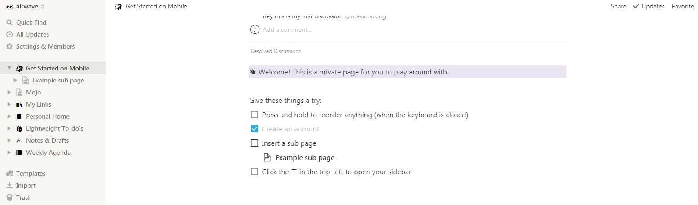
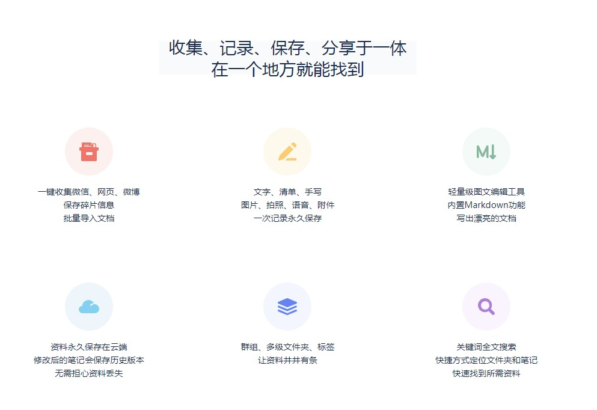

>
好记性不如烂笔头
The palest ink is better than the best memory.

### Notion

  

> A new tool that blends your everyday work apps into one. It's the all-in-one workspace for you and your team

来自国人Ivan的笔记应用和协作工具，强大到不行的Block模块以及支持动态富文本，支持[`Windows` 、`macOS`、`Android`、`iOS`]。

桌面版： https://www.notion.so/desktop
移动版： https://www.notion.so/mobile

中文社区：https://www.notion.so/linkwork/Notion-Work-6d8058e5e6b346a58130015755c4d1f0

Notion AI：https://www.notion.so/product/ai

### 为知笔记

> 大脑是用来思考的，记录的事情交给我们

> 一键收藏、全端全文检索、多级目录、Markdown

一款跨平台(`Windows` 、`macOS`、 `Linux`、 `Android`、`iOS`)的国产笔记用，支持markdown。

### 有道云笔记

网易旗下的跨平台[`Windows` 、`macOS`、`Android`、`iOS`]笔记工具，支持，文字、手写、录音、拍照多种记录方式，支持任意附件格式。

### Leanote 蚂蚁笔记 

 

支持 Markdown 的开源国产笔记应用，同步需付费

### Obsidian

 

Obsidian is a powerful knowledge base that works on top of a local folder of plain text Markdown files.

> The human brain is non-linear: we jump from idea to idea, all the time. Your second brain should work the same.

免费的双向链笔记软件。

### Simplenote

 

> The simplest way to keep notes.
Light, clean, and free.
Simplenote is now available for iOS, Android, Mac, Windows, Linux, and the web.

基于跨平台(`Windows` 、`macOS`、 `Linux`、 `Android`、`iOS`、`Web`)数据云同步的的免费笔记应用。

### EverNote印象笔记

 

>你的笔记。变得井井有条。轻松整理。
随时随地记笔记。更快查找信息。和任何人分享观点。会议记录、网页、项目待办事项—有了 Evernote 笔记应用，确保毫无疏漏。

大名鼎鼎的老牌跨平台笔记工具，建议使用国际版。

Verse：https://verse.app.yinxiang.com/product/

印象AI：https://www.yinxiang.com/about/yxai-yxbj/

印象图记：https://www.yinxiang.com/product/evermind/

可以用 [马克飞象](https://maxiang.io/) 来进行markdwon创作。

### Boostnote

  

开源的跨平台[`Windows` 、`macOS`、 `Linux`]笔记应用，极客风格满满。

### Cmd Markdown(作业部落)

  

很早的大概2014年的国产 Markdown笔记应用，支持[`Windows` 、`macOS`、 `Linux`、 `Web`]

在线编辑: https://www.zybuluo.com/mdeditor

### Roam Research

> As easy to use as a document. As powerful as a graph database.
Roam helps you organize your research for the long haul.

一款创新、颠覆型的笔记应用，付费。

参考：[Roam Reserach 到底好在哪儿？](https://zhuanlan.zhihu.com/p/145384101)

### OneNote

 

微软Office套件之一，与Office完美融合，有众多意想不到的功能。

### 看云

 

专注于文档在线创作、协作和托管的文档写作平台。

 https://www.kancloud.cn/app

#### 其他

- [Laverna]:https://github.com/Laverna/laverna(已停止维护)

