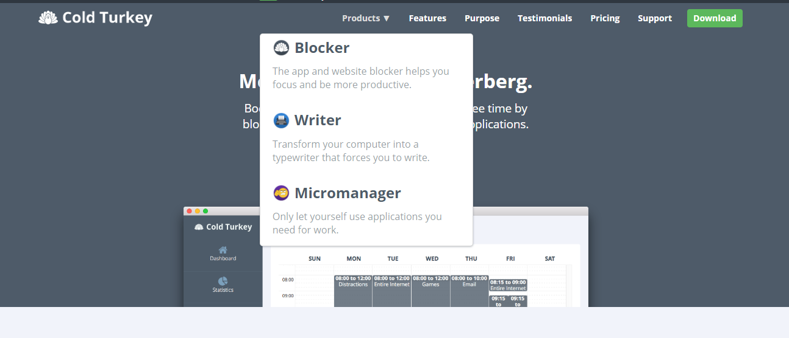
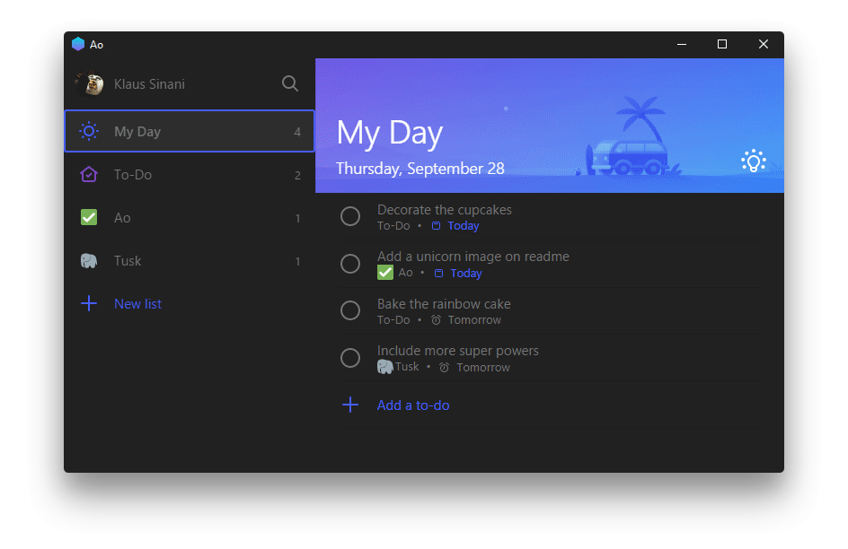
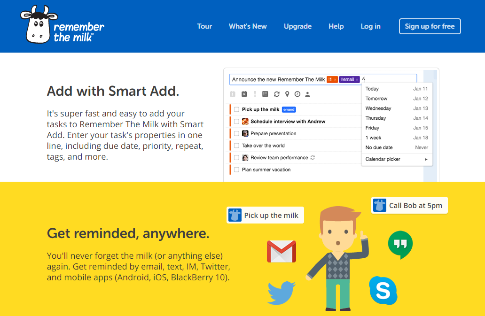
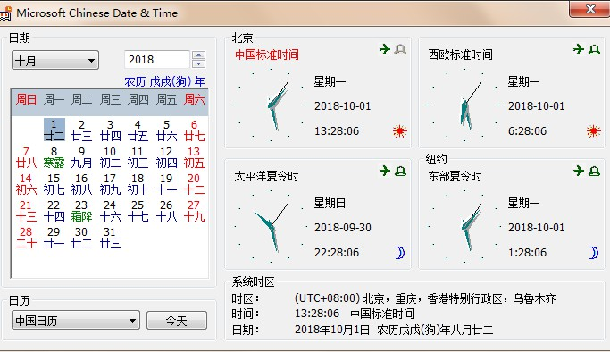

### Cold Turkey 

> Boost your productivity and reclaim your free time by blocking distracting websites, games and applications.

Cold Rurley，本意是一种强制戒除上瘾物的方法，快速但是很不愉快，比如戒除药物、毒品或酒精等，该软件能屏蔽能分散你注意力的东西，支持[`Windows` 、`macOS`]

### RescueTime 

分析你在应用与页面上使用的时间并给出详细活动报告，支持[`Windows` 、`macOS``Android`、`iOS`]

### ManicTime 
类似RescueTime的功能，支持[`Windows` 、`macOS`、 `Linux`、 `Android`]

### Focusbooster  

> **Designed to make you do more**
Use focus booster to apply the pomodoro technique, over come distractions, maintain focus, stay fresh and still finish work on time.

一款跨平台[`Windows` 、`macOS`、`Android`、`iOS`]的番茄工作法Pomodoro软件。

### Xoring  

也是一款基于番茄工作法的时间管理软件。

### Ao   

一款优雅专业的日程管理软件，支持[`Windows` 、`macOS`、 `Linux`]

### Rememberthemilk  

一款日程管理工具，提供在线待办事项列表与任务管理的功能，支持所有平台。

> Apps for the web, Mac, Windows, Linux, Apple Watch, iPhone, iPad, Android phones & tablets, BlackBerry 10, and Fire.

### YYNote 
小黄条，一款跨平台todolist，手机、PC双向同步 ，随时随地管理任务,同步需付费。

### Desktopcal 桌面日历  

> 双击桌面即可记录琐事，非常方便，非常实用。桌面日历®能帮您轻松管理约会、待办事项、日程安排 ... 不仅如此，桌面日历®还提供万年农历、24节气与各种常见的节庆、纪念日等信息。

### Microsoft Chinese Date & Time

微软出品的一款小巧的时间日历小工具，可以看农历、时区，虽然界面古老了点儿，但十分实用！

 https://www.7down.com/soft/37259.html
 https://drive.google.com/file/d/0B5Vgls5kqKMSQXF1TkRmU1FpUGs/view

