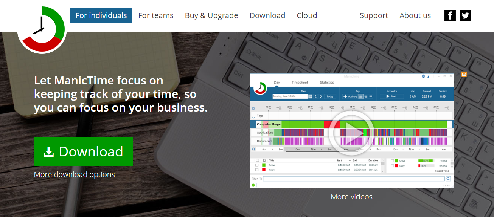

## Todolist

微软TODO：https://todo.microsoft.com/

**YYNote** 
小黄条，一款跨平台todolist，手机、PC双向同步 ，随时随地管理任务,同步需付费。

## 便笺(Sticky Notes)

微软便签：https://apps.microsoft.com/store/detail/microsoft-%E4%BE%BF%E7%AC%BA/9NBLGGH4QGHW?hl=zh-cn&gl=cn&icid=en_US_Store_UH_apps_Win

Simpe sticky notes

Stickies

## 番茄工作法

**Focusbooster**  

> **Designed to make you do more**
Use focus booster to apply the pomodoro technique, over come distractions, maintain focus, stay fresh and still finish work on time.

一款跨平台[`Windows` 、`macOS`、`Android`、`iOS`]的番茄工作法Pomodoro软件。

**Xoring**  

也是一款基于番茄工作法的时间管理软件。

**番茄人生：**http://www.tomatolife.cn/index.html OR https://www.tomatolist.com/

> 一个融合了番茄工作法、紧急重要四象限工作法、GTD工作法 ，最小化到任务栏中即是迷你番茄时钟的待办事项软件

在线版：https://www.tomatolist.com/timer.html

## 休息时间

### Cold Turkey

> Boost your productivity and reclaim your free time by blocking distracting websites, games and applications.

Cold Rurley，本意是一种强制戒除上瘾物的方法，快速但是很不愉快，比如戒除药物、毒品或酒精等，该软件能屏蔽能分散你注意力的东西，支持[`Windows` 、`macOS`]

### RescueTime

分析你在应用与页面上使用的时间并给出详细活动报告，支持[`Windows` 、`macOS`、`Android`、`iOS`]

### ManicTime

类似RescueTime的功能，支持[`Windows` 、`macOS`、 `Linux`、 `Android`]

## 日程管理

## Timely

一款由Timely公司开发的AI驱动的时间跟踪软件。它可以帮助您自动记录您在各种网络和桌面应用程序中花费的时间。

https://timelyapp.com/

### Ao

 

一款优雅专业的日程管理软件，支持[`Windows` 、`macOS`、 `Linux`]

### Rememberthemilk
 

一款日程管理工具，提供在线待办事项列表与任务管理的功能，支持所有平台。

> Apps for the web, Mac, Windows, Linux, Apple Watch, iPhone, iPad, Android phones & tablets, BlackBerry 10, and Fire.

### My Brain

Open-source, All-in-one productivity app for Tasks, Notes, Calendar, Diary and Bookmarks.

下载地址:https://f-droid.org/en/packages/com.mhss.app.mybrain/

GIthub： https://github.com/mhss1/MyBrain

