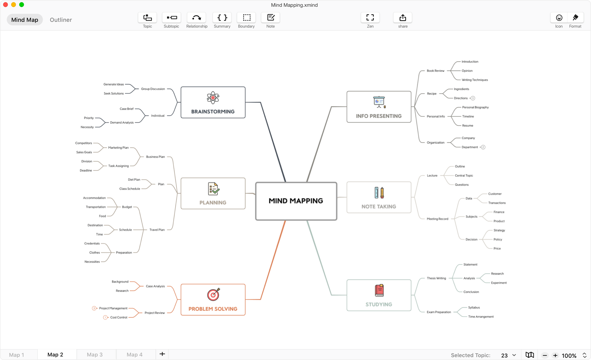
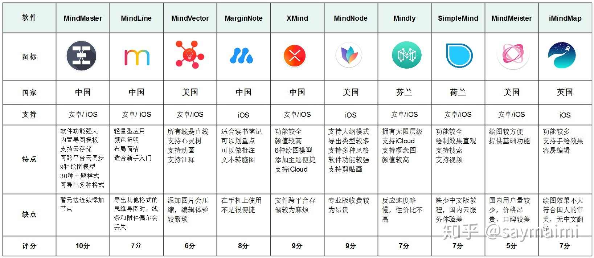

## XMind
  

> 思如泉涌 • 成竹在图

跨平台[`Windows` 、`macOS`、 `Linux`、 `Android`、`iOS`]的思维导图工具，带有免费的云端同步，免费版功能有限。

 XMind ZEN - https://www.xmind.net/download/zen

 XMind 8 - https://www.xmind.net/download/xmind8

 XMind mobile - https://www.xmind.net/download/mobile

Xmind Copilot：https://xmind.ai/

## Mindmanager

 

> The World's Most Powerful Mind Mapping Software
Connect everything that matters in your work, to everywhere you are — and get to where you WANT to be.

一款专业的思维导图工具，有中国特供版,支持[`Windows` 、`macOS`]

## iMindMap
 

一款方便的手绘思维导图软件，捕捉您的最佳想法，可视化和理解数据，支持[`Windows` 、`macOS`]。

## FreePlane

 

Freeplane is a free and open source software application that supports thinking, sharing information, getting things done at work, in school and at home. 

下载地址: https://sourceforge.net/projects/freeplane/files/

## 万兴亿图

  

万兴科技旗下办公软件系列：

亿图图示EdrawMax, 含软件和在线版

亿图脑图MindMaster x, 含软件和在线版,  https://www.edrawsoft.cn/mindmaster/?AI-bot

亿图项目管理EdrawProj
亿图组织架构管理OrgCharting

协同设计软件Pixso
协同白板BoardMix

数学工具EdrawMath

## 白板工具

博思AI白板：https://boardmix.cn/ai-whiteboard/

妙办画板： https://imiaoban.com/ai/mind

## 思维导图在线版

ChatMind：https://www.chatmind.tech/

Whimsical：https://whimsical.com/ai-mind-maps

AmyMind：https://amymind.com/

Ayoa Ultimate：https://www.ayoa.com/ultimate/

Taskade：https://www.taskade.com/

Miro AI：https://miro.com/mind-map/

百度脑图: https://naotu.baidu.com/home

GitMind思乎：https://gitmind.cn/

TreeMind：https://shutu.cn/

