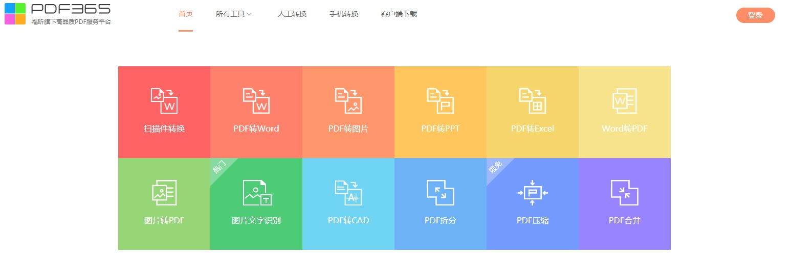
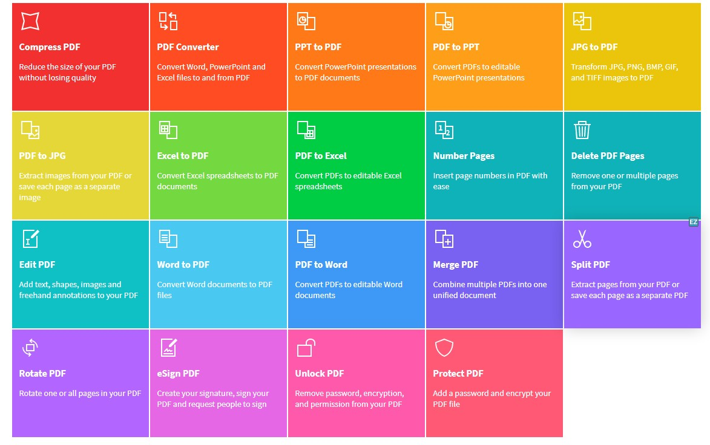
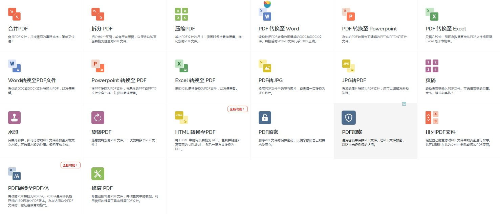

>
PDF（Portable Document Format），由Adobe公司开发的跨平台便携文档格式。

在线PDF工具：

### PDF365 

### SmallPDF  

绝佳的PDF在线工具箱，注意有转换次数限制。

### ilovepdf 

> PDF爱好者的在线工具
完全免费、易于使用、丰富的PDF处理工具，包括：合并、拆分、压缩、转换、旋转和解锁PDF文件，以及给PDF文件添加水印的工具等。仅需几秒钟即可完成。

### Allinpdf  

Allinpdf转换是一个在线的基于Web的文档到PDF转换软件。

DWG Viewer: https://allinpdf.com/cn/dwg-viewer

### Pdfresizer

> PDFResizer.com PDF editor allows you to instantly split and merge, optimize, crop, resize, and convert your documents online with just a couple of clicks.

https://pdfresizer.com/