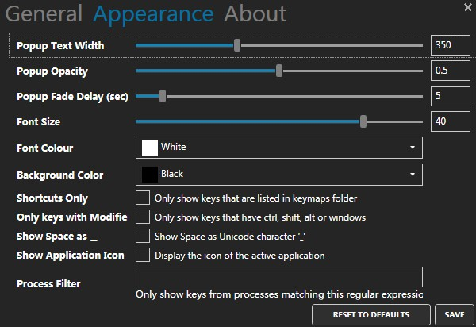
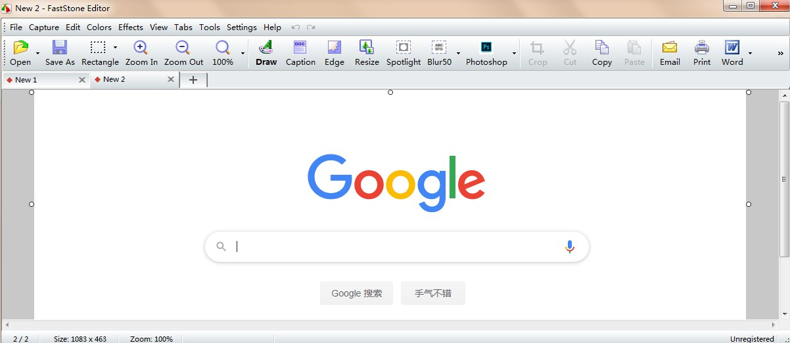

## Carnac
   

一款由[@code5](https://github.com/Code52)开发的，可以在屏幕录制期间, 显示按下的键位的开源辅助软件。

 https://github.com/Code52/carnac/releases

第三方定制增强：https://github.com/bfritscher/carnac

类似显示键盘状态有keyviz，输入法状态可用ImTip / Mouse Inc，鼠标点击状态可用ClickShow

## FSCapture
   

FastStone Capture, 一款体积小巧、功能强大的屏幕捕捉工具，可以捕捉屏幕上的任何区域，提供多种捕获方式，包括活动窗口、指定窗口/对象、整个屏幕、矩形/手绘区域，甚至滚动窗口/网页。它还允许您将屏幕活动和声音录制到视频文件中。

## Fraps
  

专业的游戏视频屏幕录制机，支持录制使用 DirectX 或 OpenGL 技术的游戏。

## Bandicam
  

韩国开发的一款强大的屏幕视频录制工具，支持录制超高清视频，不管是录游戏(支持显示FPS)还是录视频都十分方便。

## Ocam
   

一款设计简单但功能强大的屏幕视频录制与截屏工具。

## CamtasiaStudio
  

一款全能的视频录制工具，支持基本的视频编辑和剪辑。

## OBS Studio
  

Open Broadcaster Software，简称OBS，一款开源的，功能十分强大的，可用于屏幕录制和直播录制(video recording and live streaming)，支持所有流媒体平台, 支持[`Windows` 、`macOS`、 `Linux`]，支持添加插件。

## Ev录屏

EVCapture, 由国人开发的免费无水印，集视频录制与直播推流于一身的桌面录屏软件, 轻便小巧，无水印，支持[`Windows` 、`macOS`、 `Android`]，不过可能在部分电脑不支持高分屏。

## 浏览器录制

cam-recorder：https://www.cam-recorder.com/