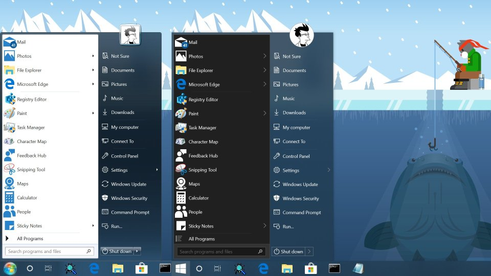
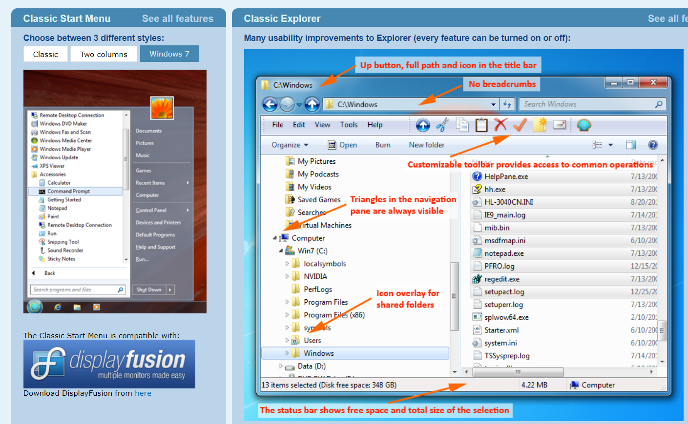

## Windows界面外观

### StartIsBack++

 

> Alternate reality where Windows 7 shell survived

Windows10开始菜单增强工具, 恢复Windows 7风格的经典样式。

### Start10
  

与Object Dock一样，出自Stardock 的开始菜单和任务栏增强软件。

###  Classic Shell

一款免费的开始菜单和资源管理器增强软件。

### 7+ Taskbar Tweaker

定制和扩展Windows任务栏，支持Win10。

### Winaero Tweaker

自由调整定制Windows的界面外观。

### TranslucentTB

 

一款开源的Windows任务栏美化软件，主要作用是Windows 10任务栏透明栏工具, 打开Windows应用商店搜索即可。

### TaskbarX

 

一款开源的Windows任务栏美化软件

## Windows状态栏

### EarTrumpet

  

  https://www.microsoft.com/zh-cn/store/p/eartrumpet/9nblggh516xp

一键调整win10应用的音量

### Traymond

 

将任意程序窗口最小化到后台托盘

## Windows桌面

### AquaSnap

法兰西Nurgo开发的Windows桌面窗口排列和布局管理工具

### 腾讯桌面（deskgo）

腾讯桌面整理本来是腾讯电脑管家中的一款扩展应用，但是如今已经剥离出来可以单独下载了。软件本身十分轻量化，没有广告没有捆绑，功能也十分单一，就是给桌面图标分类。

它最主要的功能是帮助你在桌面上把很多图标用格子进行分类，你可以组织管理甚至美化这些部件，而且功能也不仅如此，其特色包括

- 自动整理桌面，一键将应用、文件等自动分类
- 整理文件图标，你可以设置桌面区域，把不同软件和文件放到格子中
- 文件映射，可以把磁盘中的文件夹映射到桌面，方便使用
  快速搜索，可以快速搜索电脑中的文件
- 更换壁纸，可以从壁纸库下载和更换壁纸
- 其他，还有很多小功能比如桌面便签、隐藏快捷方式箭头

### 酷呆桌面

小巧快速. 酷呆桌面支持硬件加速渲染引擎, 运行速度快，占用CPU、内存等资源非常小，在win7、win10、win11系统运行非常稳定, 自动分类整理桌面上的快捷方式、目录、图片等文件。

https://www.coodesker.com/

### Fences

一款由stardock开发的实用的桌面整理软件，你可以使用它在桌面上创建桌面分区，并且给他们命名，然后根据分类或者其他的方式把软件图标分别放在不同的位置，从而可以让我们更轻松地找到自己想要使用的文档或者软件。

## 资源管理器

### Clover

     

> 为您的 Windows Explorer 插上翅膀！

Windows下类似Chrome浏览器的多标签页管理工具，推荐便携去广告版

 win10下可能不稳定，容易崩溃，已修复

### QTTabBar

一款Windows资源管理器插件，可以添加多标签和额外文件夹视图。

QTTabBar is a small tool that allows you to use tab multi label function in Windows Explorer.

Github: https://github.com/indiff/qttabbar

QTTabBar国内优化版: https://gitee.com/qwop/qttabbar

### WindowsTabs

   

> WindowTabs is a utility which brings browser-style tabbed window management to the desktop. I created this utility in 2009 and provided a free and paid version. I'm now open sourcing it since I no longer have time to maintain it.

小巧的Windows程序多标签页工具，给你喜爱的任意程序添加标签页，作者已停止维护。

 https://www.iplaysoft.com/windowtabs.html

### multrin

Organize apps windows in tabs like in abandoned Windows Sets and more

https://github.com/sentialx/multrin

### Easy Window Switcher

我们都知道可以用「Alt + Tab」进行全局应用切换，但同一个应用若要快速切换，就可以用这个小软件实现。

### Groupy

Bringing Tabs to All of Your Favorite Applications

https://www.stardock.com/products/groupy/

### 百页窗

集合文件管理所需，为高效而生

https://shutters.160.com/index.html

### extab

官网：　www.extab.cn
Github:  https://github.com/lily-debug/extab

### Wintop

小巧的任意窗口置顶器。

 http://www.wmzhe.com/soft-4351.html

### Deskpins

窗口置顶

### 快速切换窗口

 switcheroo / 曹操快切

## 屏幕工具

Iris: https://iristech.co/

> Prevent Eye strain. Iris optimizes screen pulsations by controlling the brightness without PWM. · 

LightBulb: https://github.com/Tyrrrz/LightBulb

> Reduces eye strain by adjusting gamma based on the current time

虚拟屏幕: usbmmidd_v2

## 其他Windows 工具

Folder painter: https://www.sordum.org/10124/folder-painter-v1-3/

PathCopy:路径复制

No Meiryo UI: Windows默认字体修改

WiseAutoShutdown: 智能自动关机

ExtraChm：CHM阅读器

BackupSML: windows磁贴备份

