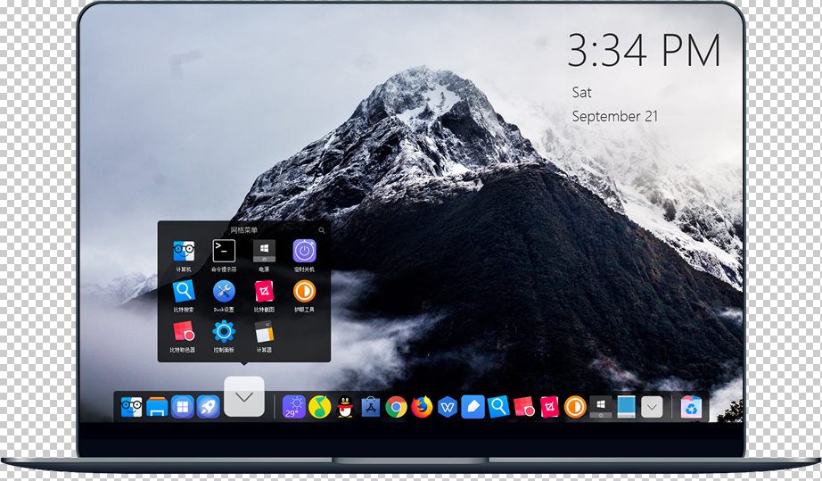

## Rainmeter

   

雨滴Rainmeter，超级酷炫的知名老牌桌面美化软件，高度自定义，插件眼花缭乱，应接不暇，令人叹为观止。

 资源站点：
- https://bbs.rainmeter.cn/
- http://tieba.baidu.com/f?kw=rainmeter
- https://www.deviantart.com/rainmeter/gallery/

## SAO-Utils
 

 国人开发的仿刀剑神域风格的SAO风格启动菜单。

## Bitdock
 

国产的由比特实验室开发的类似于[objectdock](https://www.stardock.com/products/objectdock/)、[rockerdock](https://punklabs.com/)的dock停靠栏工具，功能及效果类似于使用快捷键`win + tab` 切换多任务加使用Win10 自带的任务栏仿dock, 包括文件夹分类、网页收藏、任务栏透明等实用功能。

---

其他小工具：

软媒美化大师

IconRestorer