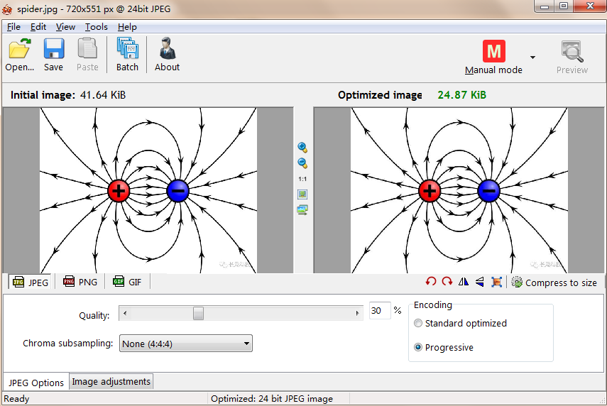
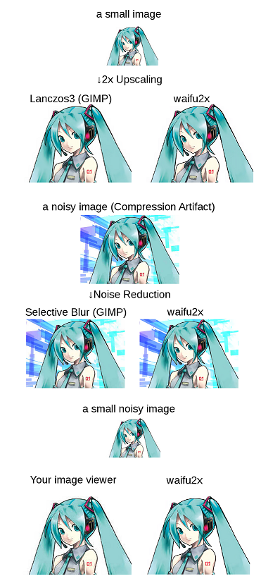

## ImageMagick
 

一个免费的创建、编辑、合成图片的软件, 支持命令行

## Riot
  

图像优化与压缩工具。

## pngquant

近乎无损的png压缩工具。

## Image Optimizer

高质量图片大小压缩处理软件。

## 图片放大与降噪

CodeFormer_Gui

Real-ersgan Gui

Upscayl

### waifu2x-caffe   

开源的图片放大与降噪工具，使用卷积神经网络对动漫风格的图片进行放大操作（支持照片）。

