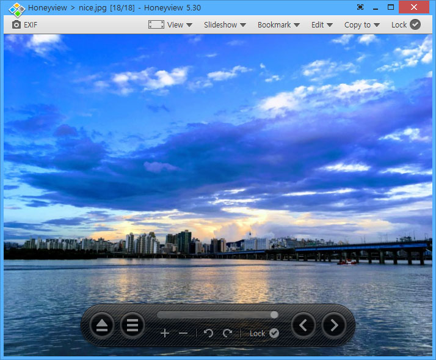

### XnView   

老牌的图片浏览工具，还可进行图片编辑，占用资源小，打开格式非常多，功能强大。

### Honeyview   

 蜂蜜浏览器，出自著名韩国开发商bandisoft之手的一款轻量级图像浏览器。

### Picasa   {#Picasa} 

整理、修改并共享照片，已停止维护

遗留的网址在这儿：http://picasa.google.com

### Zoner Photo Studio    

Zoner Photo Studio(数码照片管理工具)是一款非常实用的数码照片管理及编辑工具。软件为用户提供管理、编辑、分享等一站式照片处理功能.

### ACDSee   

一款经典的，历史悠久的图片查看器，以前学校常用

 https://www.acdsee.com/en/products/acdsee-free/

### Irfanview    

一款小巧的图形浏览器, 也可以播放视频与音频。

### Digikam    

老牌的数字照片管理工具，允许用户按年代、目录结构或者自定义的收藏进行组织, 使用C++开发，开源，免费， 支持[`Windows` 、`macOS`、 `Linux`]，支持插件扩展。

### Eagle  

> Eagle 可以轻松管理大量图片素材，满足素材「收藏、整理、查找」的各种场景。

来自国人开发的跨平台[`Windows` 、`macOS`]图片管理软件, 类似于Mac上的`Inboard`和`Ember`, 方便管理素材，支持云同步，支持强大的标签管理，支持颜色找图与想法标注等，但比较伤磁盘，以及占用磁盘空间，图片很多的时候(>10000)，也容易卡死。

----

> 图片整理，也使用 Adobe Bridge & Lightroom, 这里就不标注了。