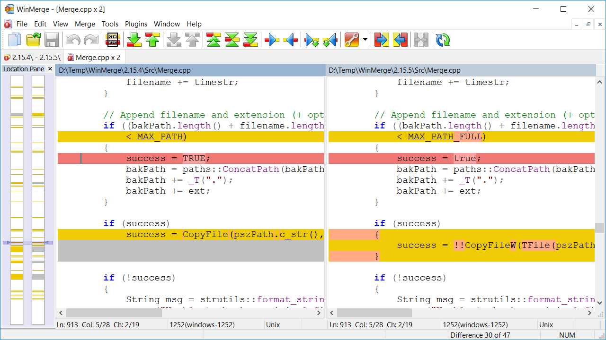

## BeyondCompare
   

一款非常强大的文本文件对比工具,几乎可以对任意文件(文件、文件夹、表格、mp3、图片、数据、注册表等)进行比较、合并、同步分析,

## UltraCompare

   

一款由UltraEdit开发的文件和文件夹比较/合并/同步应用程序。

## WinMerge

  

开源的文本比较工具。

## P4merge

一款Git可视化比较工具，也支持比较图片差异。

## Meld

可视化的跨平台文件夹对比工具，支持[`Windows` 、`macOS`]

## Diffchecker

文本比较：[https://www.diffchecker.com/](https://www.diffchecker.com/)  

图像比较: [https://www.diffchecker.com/image-diff/](https://www.diffchecker.com/image-diff/)

PDF比较:[https://www.diffchecker.com/pdf-diff/](https://www.diffchecker.com/pdf-diff/)

Excel比较：https://www.diffchecker.com/excel-compare/

此工具文件夹比较，高级功能和桌面版软件需付费

## 在线比较工具

文本比较（Text Compare）：[https://www.textcompare.org/](https://www.textcompare.org/) / https://text-compare.com/

> An online diff tool that can find the difference between two text documents. Just paste and compare.

