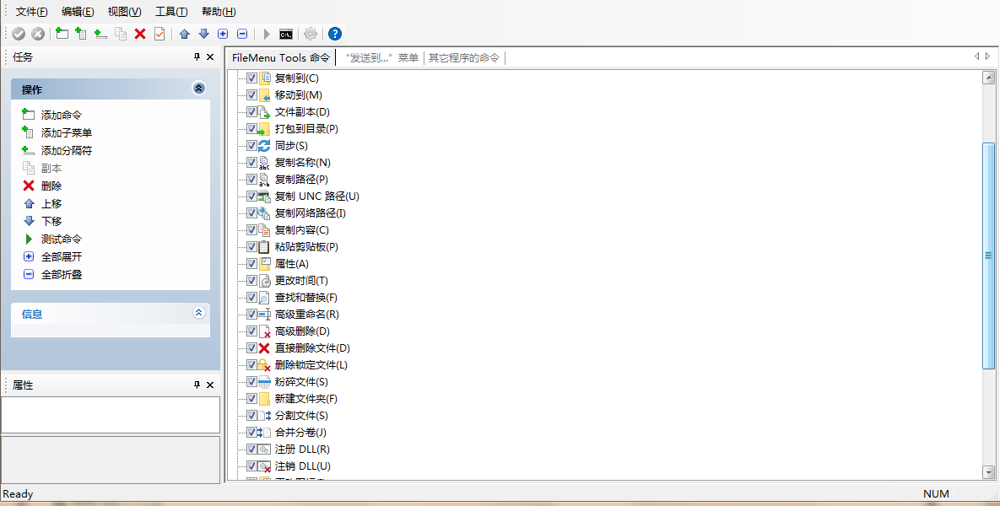

## FileMenu Tools
  

强大的Windows右键菜单自定义小工具。支持正则表达式，比如高级重命名文件，查找字符串`\((.*)\)`替换为`_$1`：

## Context Menu Manager

🖱️ 一个纯粹的Windows右键菜单管理程序

Github：https://github.com/BluePointLilac/ContextMenuManager

