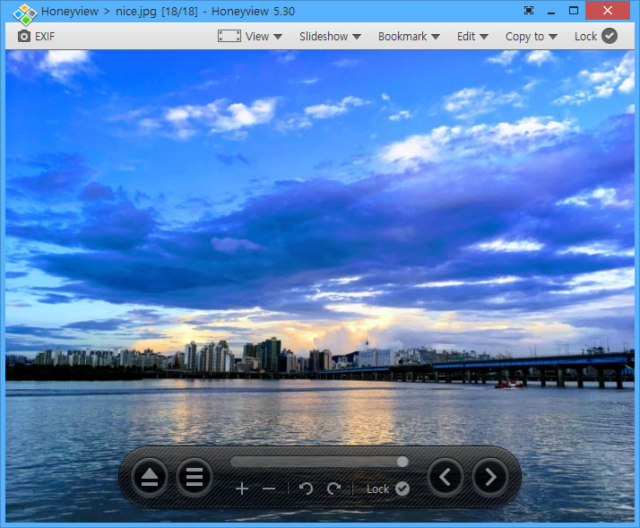

## XnView
 

老牌的图片浏览工具，还可进行图片编辑，占用资源小，打开格式非常多，功能强大。

## Honeyview
 

 蜂蜜浏览器，出自著名韩国开发商bandisoft之手的一款轻量级图像浏览器。

## Picasa

整理、修改并共享照片，已停止维护

遗留的网址在这儿：http://picasa.google.com

## Zoner Photo Studio
  

Zoner Photo Studio(数码照片管理工具)是一款非常实用的数码照片管理及编辑工具。软件为用户提供管理、编辑、分享等一站式照片处理功能.

## ACDSee
  

一款经典的，历史悠久的图片查看器，以前学校常用

 https://www.acdsee.com/en/products/acdsee-free/

## Irfanview
   

一款小巧的图形浏览器, 也可以播放视频与音频。

## ImageGlass

A lightweight, versatile image viewer

https://imageglass.org/

Github： https://github.com/d2phap/ImageGlass

## FSViewer

 FastStone Image Viewer

https://www.faststone.org/FSIVDownload.htm