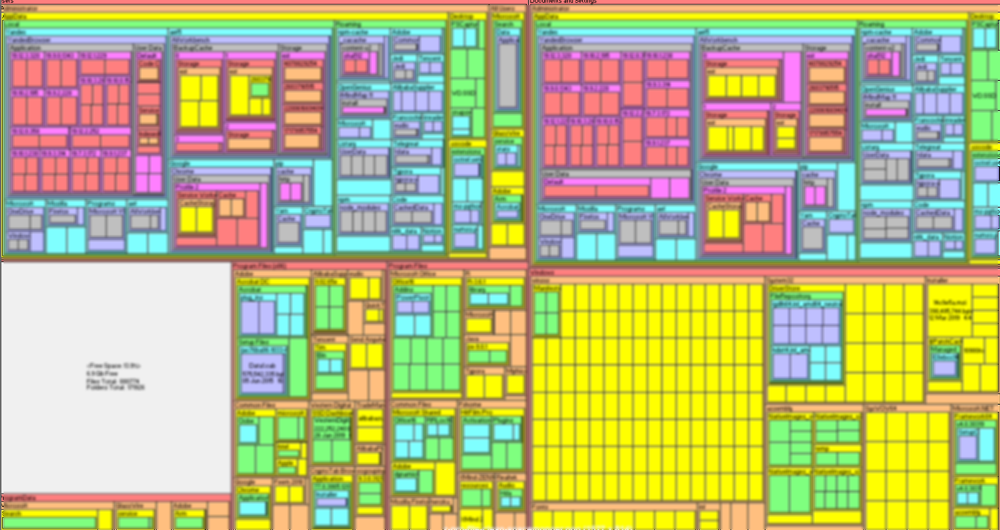

## 磁盘占用情况

### SpaceMonger
 

分析你的电脑存储空间，让你知道接下来要整理哪块儿。

 https://spacemonger.en.softonic.com/download

### WinDirStat
 

同样分析你的电脑磁盘存储空间使用情况。

### SpaceSniffer
 

一款免费开源的绿色磁盘分析工具， 使用可视化树状图布局来分析你的磁盘占用情况， Windows 磁盘分析工具。

### Wiztree

## 解锁文件占用

### Iobit Unlocker

解除无法删除文件的锁定，强制解锁工具。

### SDelete

 

微软 Sysinternals 免费工具集软件之一，用于安全删除文件。

### LockerHunter

https://lockhunter.com/

解除无法删除文件的锁定

## Dropit

按规则整理文件， Personal Assistant to Automatically Manage Your Files

http://www.dropitproject.com/

NewFileTime：一款小巧且强大的Windows文件时间戳修改工具

## TriDNET

一款由Anand Khanse开发的免费软件，它可以帮助您识别没有扩展名的未知文件类型。该软件支持Windows平台，可以识别来自二进制签名的未知文件类型。

https://www.thewindowsclub.com/identify-unknown-file-type-tridnet