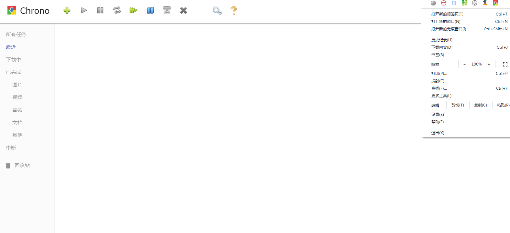

> 以谷歌浏览器为例，Edge等也可直接安装谷歌浏览器插件

# 插件网站

- 官网： https://chrome.google.com/webstore/category/extensions
- Chrome插件下载器: https://chrome-extension-downloader.com/
- CRX4Chrome：https://www.crx4chrome.com/ (推荐)
- 173应用：https://173app.com/chrome-ext
- 插件小屋：https://www.chajianxw.com/
- ChromeFor： https://www.chromefor.com/
- 插件网： http://www.cnplugins.com/ (可能无法正常下载)
- ChromeCJ：https://huajiakeji.com/list/

---

浏览器插件搜索：https://www.crxsoso.com/
浏览器插件导航：收藏猫，https://pictureknow.com/

#  插件推荐

> 书签工具见[website-collection-tools](../internet-tools/website-collection-tools.md)

### 基本功能增强

- Chrono下载管理器：超好用的替代谷歌浏览器的下载工具，支持资源嗅探，貌似chrome商店找不到了，作者也放弃更新了
  ~~备用: https://www.crx4chrome.com/crx/1008/~~

  | (• ◡•)| (❍ᴥ❍ʋ) 2021新年，TA回来了！！！！

  官网: [https://www.chronodownloader.net](https://www.chronodownloader.net/)

  chrome商店：https://chrome.google.com/webstore/detail/chrono-download-manager/mciiogijehkdemklbdcbfkefimifhecn
  
- Coconut下载器 / 猫抓:

  https://chrome.google.com/webstore/detail/%E7%8C%AB%E6%8A%93/jfedfbgedapdagkghmgibemcoggfppbb 网页媒体嗅探工具

  https://github.com/xifangczy/cat-catch
  文档说明: https://o2bmm.gitbook.io/cat-catch/

  > 参考文章: https://new.qq.com/rain/a/20221013A021GZ00

- 扩展管理器（Extension Manager）：一键管理所有扩展，快速开启/禁用

  

  ~~chrome商店：https://chrome.google.com/webstore/detail/extension-manager/gjldcdngmdknpinoemndlidpcabkggco~~

- SelectionSK： 文本选择加强，使用鼠标选择文本时，使用有用的工具（复制，搜索，翻译，突出显示等）弹出用户菜单。

  https://chrome.google.com/webstore/detail/selectionsk/npohodmlkdednnlbhfegpnhohpgckocf

- SuperCopy 超级复制：一键破解禁止右键、破解禁止选择、破解禁止复制、破解禁止粘贴，启用复制，启用右键，启用选择，启用粘贴。

  https://chrome.google.com/webstore/detail/supercopy-enable-copy/onepmapfbjohnegdmfhndpefjkppbjkm

- Chrome Regex Search：使chrome支持正则表达式
  chrome商店：https://chrome.google.com/webstore/detail/chrome-regex-search/bpelaihoicobbkgmhcbikncnpacdbknn

- EditThisCookie：cookie编辑工具，简易添加，删除，编辑，搜索，锁定和屏蔽cookies！
  https://chrome.google.com/webstore/detail/editthiscookie/fngmhnnpilhplaeedifhccceomclgfbg

- Charset: 网页默认编码切换

  chrome商店：https://chrome.google.com/webstore/detail/charset/oenllhgkiiljibhfagbfogdbchhdchml

  GitHub 开源地址：https://github.com/jinliming2/Chrome-Charset
  
- 简悦 - SimpRead：让你瞬间进入沉浸式阅读的 Chrome 扩展，类似 Safari 的阅读模式，完整版需付费。

  chrome商店：https://chrome.google.com/webstore/detail/simpread-reader-view/ijllcpnolfcooahcekpamkbidhejabll
  
  类似工具: WechatDownloader / SingleFile / Circle
  
- Just Read：https://chrome.google.com/webstore/detail/just-read/dgmanlpmmkibanfdgjocnabmcaclkmod

  https://justread.link/，类似简悦 - SimpRead

  Github：https://github.com/ZachSaucier/Just-Read

- NaturalReader: Read aloud any text with realistic AI voices, compatible with webpages, kindle Ebooks, Google Docs, PDF, Emails, and more.

  chrome商店：https://chrome.google.com/webstore/detail/naturalreader-ai-text-to/kohfgcgbkjodfcfkcackpagifgbcmimk
  
  https://www.naturalreaders.com/online/
  
- 油小猴工具箱 - 上网神器: 一款超级强大的网页增强扩展，即能实现【网盘直链下载助手】【网盘智能识别助手】【网页加速器】【Mactype助手】【星号密码显示助手】五大助手的全部功能，真正做到免配置开箱即用, 右键不同内容还能实现 二维码生成/解码，识别验证码，免翻搜索扩展 功能。

  https://www.youxiaohou.com/box.html
  
- 集装箱:  一个插件，提供一揽子服务，提供二维码生成、Cookie管理、Aria下载管理等小工具

  https://a.newday.me/

### 标签工具

  - Infinity New Tab (Pro)：自定义你的新标签页，支持云同步

    官网: https://en.infinitynewtab.com/

    

    chrome商店：https://chrome.google.com/webstore/detail/infinity-new-tab-pro/nnnkddnnlpamobajfibfdgfnbcnkgngh

    firefox: https://addons.mozilla.org/zh-CN/firefox/addon/infinity-new-tab-pro-firefox/

 - OneTab Plus:标签效率管理扩展： 标签高效管理，节省95％的内存
   chrome商店：https://chrome.google.com/webstore/detail/onetab-plustab-manage-pro/lepdjbhbkpfenckechpdfohdmkhogojf

  - The Great Suspender：冻结暂时用不到的标签页，以便释放系统资源
    chrome商店：https://chrome.google.com/webstore/detail/the-great-suspender/klbibkeccnjlkjkiokjodocebajanakg

  - Favioli：给没有图标的网页添加emoji
    chrome商店：https://chrome.google.com/webstore/detail/favioli/pnoookpoipfmadlpkijnboajfklplgbe

  - Tab Resize - split screen layouts：Chrome分割屏幕布局
    chrome商店：https://chrome.google.com/webstore/detail/tab-resize-split-screen-l/bkpenclhmiealbebdopglffmfdiilejc
    
  - WeTab-AI新标签页：Wetab是一款可以亲手打造属于自己的高颜值主页的小组件新标签页插件，跟Infinity New Tab新标签页一样美观大气，跟iTab iTab新标签页一样主打小组件功能。iOS苹果小组件卡片设计，内置倒计时、纪念日、天气、热搜、计算器、等超酷小组件，让信息一目了然，标签页整洁美观。

    https://wetab.link/

    https://chrome.google.com/webstore/detail/wetab-ai%E6%96%B0%E6%A0%87%E7%AD%BE%E9%A1%B5/aikflfpejipbpjdlfabpgclhblkpaafo
    
- monknow 

- iTab

### 快捷操作

- Vimium：老牌的键盘操作插件
  https://chrome.google.com/webstore/detail/vimium/dbepggeogbaibhgnhhndojpepiihcmeb

- Surfingkeys：快捷键工具，比vim好用
  https://chrome.google.com/webstore/detail/surfingkeys/gfbliohnnapiefjpjlpjnehglfpaknnc

- crxMouse Chrome™ 手势

  Gestures for Chrome(TM)汉化版.方便,快捷,充分发掘鼠标的所有操作.功能包括:鼠标手势,超级拖曳,滚轮手势,摇杆手势,平滑滚动,标签页列表等.

  https://chrome.google.com/webstore/detail/crxmouse-chrome-gestures/jlgkpaicikihijadgifklkbpdajbkhjo/related

### 链接工具

- ezLinkPreview：链接网页预览工具
  https://chrome.google.com/webstore/detail/ezlinkpreview/nnkcfbiefgdaceeplickkkmifpicbpcc
- Copy Link Name: 复制链接标题
  https://chrome.google.com/webstore/detail/copy-link-name/mafjnaphoepgijmgfeemillelgkeigid
- Linkclump： 高效打开多个链接
  https://chrome.google.com/webstore/detail/linkclump/lfpjkncokllnfokkgpkobnkbkmelfefj

### 隐私防护

- Proxy SwitchyOmega：功能强大的代理切换工具, 轻松快捷地管理和切换多个代理设置。登录chrome谷歌账号后，支持情景模式选项同步。
  chrome商店：https://chrome.google.com/webstore/detail/proxy-switchyomega/padekgcemlokbadohgkifijomclgjgif

- 谷歌上网助手 开发版: 科学上网，仅供学术研究使用
  ： http://googlehelper.net/ 
  
- WebRTC Leak Prevent：WebRTC开关，推荐！！！
  chrome商店：https://chrome.google.com/webstore/detail/webrtc-leak-prevent/eiadekoaikejlgdbkbdfeijglgfdalml

- Moesif Orign & CORS Changer：浏览器跨域开关
  https://chrome.google.com/webstore/detail/moesif-orign-cors-changer/digfbfaphojjndkpccljibejjbppifbc

- Reggy : 保护隐私，随机生成用户密码邮箱地址并一键填表(ps: 对react等框架无效)，推荐！！！

  ~~https://chrome.google.com/webstore/detail/reggy/pnneajlgffpejnabhionnhdfhibijihe~~

  文章阅读: https://huajiakeji.com/productivity/2019-05/2681.html

- Lightning Autofill：自动填充表单, 注意目前要收费
  https://chrome.google.com/webstore/detail/autofill/nlmmgnhgdeffjkdckmikfpnddkbbfkkk

### 图片工具

- GoFullPage - Full Page Screen Capture: https://chrome.google.com/webstore/detail/gofullpage-full-page-scre/fdpohaocaechififmbbbbbknoalclacl?hl=zh-CN

  Github：https://github.com/mrcoles/full-page-screen-capture-chrome-extension

  完整可靠地捕获当前页面的屏幕截图

- 高效网页截图编辑插件：截取任意网页，拥有强大的屏幕录像功能

  官网：https://jasonsavard.com/Explain-and-Send-Screenshots

  chrome商店：https://chrome.google.com/webstore/detail/explain-and-send-screensh/mdddabjhelpilpnpgondfmehhcplpiin

- Nimbus 截幕 & 屏幕录像机：全屏幕捕获网页或任何部分。编辑的截图。记录的视频记录的视频从您的屏幕

  官网：https://nimbusweb.me/

  chrome商店：https://chrome.google.com/webstore/detail/nimbus-screenshot-screen/bpconcjcammlapcogcnnelfmaeghhagj

- APEX - 最佳截屏和屏幕录制工具

  chrome商店：https://chrome.google.com/webstore/detail/apex-best-screenshot-scre/igkkmokkmlbkkgdnkkancbonkbbmkioc

  最佳截屏和屏幕录制工具，完全免费，可以快速分享屏幕，截取整个页面

- 图片助手(ImageAssistant) ：一款Chrome浏览器中用于嗅探、分析网页图片、图片筛选、下载等功能的扩展程序，无论图片是使用flash载入还是动态载入的，扩展都能很好地应对，真正做到所见即所得。支持批量图片下载器，以及生成当前页二维码和图片编辑。

  官网：http://www.pullywood.com/ImageAssistant/

  chrome商店：https://chrome.google.com/webstore/detail/imageassistant-batch-imag/dbjbempljhcmhlfpfacalomonjpalpko

- Imagus：鼠标指针悬停在链接或缩略图上时直接在当前页面的弹出视图上显示这些图片、HTML5 视频/音频和内容专辑。
chrome商店：https://chrome.google.com/webstore/detail/imagus/immpkjjlgappgfkkfieppnmlhakdmaab

- 二箱: 多引擎以图搜图

  github：https://github.com/AInoob/NooBox

  chrome商店：https://chrome.google.com/webstore/detail/noobox/kidibbfcblfbbafhnlanccjjdehoahep

- Google Chrome™的完整页面截图

  https://chrome.google.com/webstore/detail/full-page-screenshot-for/mieibeigpaehbjcbibakjcmkocngijjl
  
- 简单封面

  https://chromewebstore.google.com/detail/%E7%AE%80%E5%8D%95%E5%B0%81%E9%9D%A2/fioaflpmjimjbjmhokcbnpfgglnehilc?hl=zh-CN&pli=1

  用最简单的方式制作封面,简单封面，用最简单的方式制作封面图片

  无登录 无付费 无广告 无打扰,做最好用最简单的封面图制作工具

### 语言学习

- 沙拉查词-聚合词典划词翻译：超级好用且专业的划词翻译扩展，大量权威词典涵盖中英日韩法德西语，支持复杂的划词操作、网页翻译、生词本与 PDF 浏览。

  官网：https://saladict.crimx.com/

  chrome商店：https://chrome.google.com/webstore/detail/%E6%B2%99%E6%8B%89%E6%9F%A5%E8%AF%8D-%E8%81%9A%E5%90%88%E8%AF%8D%E5%85%B8%E5%88%92%E8%AF%8D%E7%BF%BB%E8%AF%91/cdonnmffkdaoajfknoeeecmchibpmkmg

- 沉浸式网页双语翻译（沉浸式翻译）: 沉浸式网页双语翻译扩展，免费使用，支持 Deepl/Google/腾讯/火山翻译等多个翻译服务，支持 Firefox/Chrome/油猴脚本，亦可在 iOS Safari 上使用。

  帮助文档: https://immersive-translate.owenyoung.com/usage

  chrome商店：https://chrome.google.com/webstore/detail/immersive-translate/bpoadfkcbjbfhfodiogcnhhhpibjhbnh/related

- 侧边翻译：[侧边翻译 - Microsoft Edge Addons](https://microsoftedge.microsoft.com/addons/detail/侧边翻译/bfdogplmndidlpjfhoijckpakkdjkkil)

  侧边翻译是一个简单实用的翻译插件，支持Chrome浏览器、火狐浏览器、360安全浏览器等主流浏览器。

- Grammarly for Chrome： 语法纠错
chrome商店：https://chrome.google.com/webstore/detail/grammarly-for-chrome/kbfnbcaeplbcioakkpcpgfkobkghlhen

- Wordtune - AI-powered Writing Companion：Your thoughts in words.

  写作插件，可代替Grammarly 

  www.wordtune.com

  chrome商店：https://chrome.google.com/webstore/detail/wordtune-ai-powered-writi/nllcnknpjnininklegdoijpljgdjkijc

- Linguix Grammar and Spell Checker： 语法纠错

  chrome商店：https://chrome.google.com/webstore/detail/linguix-grammar-and-spell/ndgklmlnheedegipcohgcbjhhgddendc

- Google 输入工具: 网页版的语言输入工具
  chrome商店：https://chrome.google.com/webstore/detail/google-input-tools/mclkkofklkfljcocdinagocijmpgbhab

### 探索世界

- Black Menu for Google™：探索 Google 的世界从未如此简单
  https://chrome.google.com/webstore/detail/black-menu-for-google/eignhdfgaldabilaaegmdfbajngjmoke
- Google学术搜索按钮
  chrome商店：https://chrome.google.com/webstore/detail/google-scholar-button/ldipcbpaocekfooobnbcddclnhejkcpn
- Unpaywall：合法下载文献
  chrome商店：https://chrome.google.com/webstore/detail/unpaywall/iplffkdpngmdjhlpjmppncnlhomiipha

## 生活助手

### 网站增强

> B站、知乎等网站增强，见各自的网站介绍页面

- HTML5视频播放器增强脚本: https://greasyfork.org/zh-CN/scripts/381682-html5%E8%A7%86%E9%A2%91%E6%92%AD%E6%94%BE%E5%99%A8%E5%A2%9E%E5%BC%BA%E8%84%9A%E6%9C%AC(需Tampermonkey 插件)
  
  HTML5视频播放增强脚本，支持所有H5视频播放网站，全程快捷键控制，支持：倍速播放/加速播放、视频画面截图、画中画、网页全屏、调节亮度、饱和度、对比度、自定义配置功能增强等功能。
  
- Global Speed: 视频速度控制

  https://chrome.google.com/webstore/detail/global-speed/jpbjcnkcffbooppibceonlgknpkniiff

- Scroll To Top Button：https://chrome.google.com/webstore/detail/scroll-to-top-button/chinfkfmaefdlchhempbfgbdagheknoj/related?hl=zh-CN

  电脑页面滑动到最底部， 给页面添加滑动功能/按钮，支持无限滑动，支持按键滑动( `alt + 方向键↑` 或 `alt + 方向键↓`)


### 网站信息

- Highlight or Hide Search Engine Results： 搜索结果相同域名颜色高亮
  https://chrome.google.com/webstore/detail/highlight-or-hide-search/ilopipickdimglkalhckioobifbiinbk
  
- IP Whois & Flags Chrome & Websites Rating：网站信息分析工具 BY http://myip.ms/
  https://chrome.google.com/webstore/detail/ip-whois-flags-chrome-web/kmdfbacgombndnllogoijhnggalgmkon, 可用Country Flags & IP Whois代替(https://chrome.google.com/webstore/detail/country-flags-ip-whois/bffjckjhidlcnenenacdahhpbacpgapo)
  
- SimilarWeb - 网站流量来源和排名: 通过SimilarWeb扩展程序查看真实的深入网站参与、流量来源和网站排名信息

  https://chrome.google.com/webstore/detail/similarweb-traffic-rank-w/hoklmmgfnpapgjgcpechhaamimifchmp

- SEOquake： 强大的SEO工具
  https://chrome.google.com/webstore/detail/seoquake/akdgnmcogleenhbclghghlkkdndkjdjc
  
- Email Extractor：方便的email提取工具
  https://chrome.google.com/webstore/detail/email-extractor/jdianbbpnakhcmfkcckaboohfgnngfcc
  
- Hunter: Find email addresses in seconds：email工具，与上配合使用
  https://chrome.google.com/webstore/detail/hunter-find-email-address/hgmhmanijnjhaffoampdlllchpolkdnj
  
- 西方媒体查一查：中文-媒体倾向评价
  https://chrome.google.com/webstore/detail/%E8%A5%BF%E6%96%B9%E5%AA%92%E4%BD%93%E6%9F%A5%E4%B8%80%E6%9F%A5/bpejcaojjipcgcnjkfmnkhokdpimcmij

### 资源匹配

- RARBG Monitor: 强大的资源匹配工具
  https://chrome.google.com/webstore/detail/rarbg-monitor/kkgcfdmlnfpdjmnheeojdlgpmhaeekga

- 豆瓣电影放映厅：帮助你收藏关注豆瓣的影视类网站相关资料，提供点播，字幕，BT相关资源的链接地址
  
  > 此扩展程序违反了 Chrome 应用商店
  
  > 暂时失效，显示国内资源都带着小姨子跑路了
  
- Honey： 自动寻找优惠券和促销码

  官网：https://www.joinhoney.com/

  chrome商店：https://chrome.google.com/webstore/detail/honey/bmnlcjabgnpnenekpadlanbbkooimhnj

### 文件传输工具

- Pushbullet： 文件传输工具 https://chrome.google.com/webstore/detail/pushbullet/chlffgpmiacpedhhbkiomidkjlcfhogd 

  https://play.google.com/store/apps/details?id=com.pushbullet.android

### 回忆过去

- Ruffle: 一个用 Rust 语言开发的 Adobe Flash Player 模拟器, 支持chrome插件安装

  https://ruffle.rs/ (将 Flash 重新带回网络)

- IE Tab：以IE内核显示网页。快捷、强健、可靠
  chrome商店：https://chrome.google.com/webstore/detail/ie-tab/hehijbfgiekmjfkfjpbkbammjbdenadd

- ~~云盘万能钥匙：自动填写百度网盘 & 蓝奏云提取密码，但会收集用户信息，请谨慎下载！
  
- ~~一叶：和浏览相同网页的人实时聊天，发弹幕！~~

  ~~官网：http://yiyechat.com/~~ ， 服务已挂， github: https://github.com/Same-Page/client

  ~~https://chrome.google.com/webstore/detail/same-page-2/bldcellajihanglphncgjmceklbibjkk~~

### 广告过滤

> 广告规则：https://github.com/easylist/easylistchina

- AdBlock： 知名的广告过滤器，在YouTube、Facebook、Twitch和其他你喜爱的网站上拦截广告和弹窗。

  > Surf the web with no annoying ads

  官网：https://adblockplus.org/

  AdBlock：https://chrome.google.com/webstore/detail/adblock/gighmmpiobklfepjocnamgkkbiglidom

  Adblock Plus ：https://chrome.google.com/webstore/detail/adblock-plus-free-ad-bloc/cfhdojbkjhnklbpkdaibdccddilifddb

- AdGuard 广告拦截器：广告拦截扩展
chrome商店：https://chrome.google.com/webstore/detail/adguard-adblocker/bgnkhhnnamicmpeenaelnjfhikgbkllg

- ~~广告净化器：挺好用的广告过滤器，也能屏蔽优酷、爱奇艺、腾讯视频等的广告~~
   https://www.yiclear.com/download/
  
> 曾经原作者劫持推广链接, 被火绒投诉，已无法使用，不过貌似又复活了，经查证，又下架了。
  >
  > 参考: https://zhuanlan.zhihu.com/p/111522990

- 广告终结者

  chrome商店：[https://chrome.google.com/webstore/detail/%E5%B9%BF%E5%91%8A%E7%BB%88%E7%BB%93%E8%80%85/fpdnjdlbdmifoocedhkighhlbchbiikl](https://chrome.google.com/webstore/detail/广告终结者/fpdnjdlbdmifoocedhkighhlbchbiikl)

### 聚精会神

- 小番茄: https://chrome.google.com/webstore/detail/cherry-tomato/cghomilbbfdmgfidkdinillpmdpdjgmm

  这个应用借助于一个衍生版本的番茄计时工作法来帮助你最大化地提升生产力。

- 关灯看视频：心无旁骛看视频
  chrome商店：https://chrome.google.com/webstore/detail/turn-off-the-lights-for-y/bfbmjmiodbnnpllbbbfblcplfjjepjdn

- Comic++：一款改变你阅读方式的漫画阅读器，摈弃传统的翻页模式，直接采用滚动翻页模式等等
  chrome商店：https://chrome.google.com/webstore/detail/comic%2B%2B/mhekhlkmjaleehfnfjfpejhegjieaaef

## 开发工具

### 脚本工具

插件脚本下载: https://greasyfork.org

- Tampermonkey：大名鼎鼎的油猴脚本

  https://chrome.google.com/webstore/detail/tampermonkey/dhdgffkkebhmkfjojejmpbldmpobfkfo

  篡改猴测试版：https://chrome.google.com/webstore/detail/tampermonkey-beta/gcalenpjmijncebpfijmoaglllgpjagf

- 暴力猴：油猴的替代品
  https://chrome.google.com/webstore/detail/violentmonkey/jinjaccalgkegednnccohejagnlnfdag

- Quick Javascript Switcher：Javascript开关
https://chrome.google.com/webstore/detail/quick-javascript-switcher/geddoclleiomckbhadiaipdggiiccfje

### CSS工具

- Amino: Live CSS Editor： 来自韩国棒子的CSS实时编辑器
  chrome商店：https://chrome.google.com/webstore/detail/amino-live-css-editor/pbcpfbcibpcbfbmddogfhcijfpboeaaf
  
- Stylish-为任意网站自定义主题：由于隐私问题下架过，目前可选
  https://chrome.google.com/webstore/detail/stylish-custom-themes-for/fjnbnpbmkenffdnngjfgmeleoegfcffe
  
- Stylus：Stylish的替代品
  https://chrome.google.com/webstore/detail/stylus/clngdbkpkpeebahjckkjfobafhncgmne
  
- Color by Fardos：配色插件，支持互补色、相邻色、三色调、四色调、渐变搭配颜色等，支持自动复制CSS代码和取色器

  https://chrome.google.com/webstore/detail/color-by-fardos-color-pic/iibpgpkhpfggipbacjfeijkloidhmiei/related

### Github增强

- Enhanced GitHub：

  https://chrome.google.com/webstore/detail/enhanced-github/anlikcnbgdeidpacdbdljnabclhahhmd

- Octotree: github增强

  https://chrome.google.com/webstore/detail/octotree/bkhaagjahfmjljalopjnoealnfndnagc/related
  
- OctoLinker: OctoLinker is a browser extension for GitHub, that turns language-specific statements like include require or import into links.

  https://chrome.google.com/webstore/detail/octolinker/jlmafbaeoofdegohdhinkhilhclaklkp


### 前端工具

- Responsive Viewer：可视化响应式布局

  https://chrome.google.com/webstore/detail/responsive-viewer/inmopeiepgfljkpkidclfgbgbmfcennb

- ChroPath: Xpath定位查看插件

  https://chrome.google.com/webstore/detail/chropath/ljngjbnaijcbncmcnjfhigebomdlkcjo

- Header Editor： 管理浏览器请求，包括修改请求头和响应头、重定向请求、取消请求

  https://chrome.google.com/webstore/detail/header-editor/eningockdidmgiojffjmkdblpjocbhgh

- User-Agent Switcher：User-Agent 切换工具
  https://chrome.google.com/webstore/detail/user-agent-switcher/dbclpoekepcmadpkeaelmhiheolhjflj
  
- User-Agent Switcher for Chrome：来自google的User-Agent 切换工具
  https://chrome.google.com/webstore/detail/user-agent-switcher-for-c/djflhoibgkdhkhhcedjiklpkjnoahfmg
  
- WEB前端助手(FeHelper)：Awesome，All In One的一个工具，包含多个独立小应用，比如：Json工具、代码美化、代码压缩、二维码、Postman、markdown、网页油猴、便签笔记、信息加密与解密、随机密码生成、Crontab等等！
  https://chrome.google.com/webstore/detail/web%E5%89%8D%E7%AB%AF%E5%8A%A9%E6%89%8Bfehelper/pkgccpejnmalmdinmhkkfafefagiiiad
  
- Vue.js devtools：Vue.js 开发工具
  https://chrome.google.com/webstore/detail/vuejs-devtools/nhdogjmejiglipccpnnnanhbledajbpd
  
- fonts infos：显示网页所有字体
  https://chrome.google.com/webstore/detail/fonts-infos/dcmemojljgjdnjfckdmffgkcnooejahg
  
- Postman: https://chrome.google.com/webstore/detail/postman/fhbjgbiflinjbdggehcddcbncdddomop

  

# 第三方插件安装

1. 以Chrono插件为例，首先在第三方插件下载站搜索并下载该crx插件，或者在chrome商店(若有)复制链接并在https://chrome-extension-downloader.com/下载crx安装包。

   > ！！！注意chrome下载crx包会自动删除, 请在非chrome浏览器下载CRX插件

   > 高级方法：
   >
   > 1、在chrome应用商店里找到该插件
   > https://chrome.google.com/webstore/detail/<id>
   >
   > 2、将如下链接中的id替换成所需id：
   >
   > `https://clients2.google.com/service/update2/crx?response=redirect&x=id%3d<id>%26uc`

2. 如果直接在开发者模式安装会显示`程序包无效："CRX_HEADER_INVALID/`，所以需要将crx文件扩展名改为zip，然后拖拽安装或者使用`加载已解压的扩展程序`即可。

3. 该方法在chrome Ver.112下测试通过。



4. Chrome安装的插件位于：```C:\Users\Administrator\AppData\Local\Google\Chrome\User Data\Default\Extensions```, Administrator为你的用户名， 此处可通过点击Chrome的`打包扩展程序`打包本地扩展为CRX文件。

