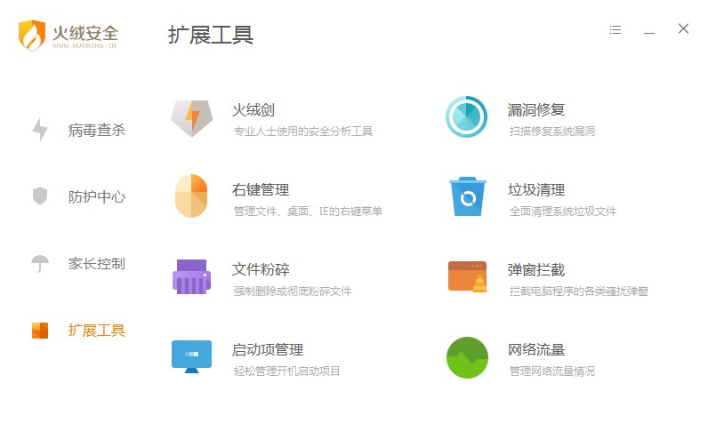
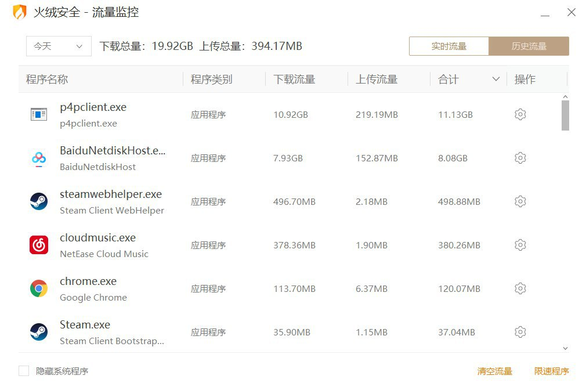

### 火绒 Huorong   

> 专业 —— 集“杀、防、管、控”于一身，安全防御更全面
实用—— 占用资源少兼容性强，办公、游戏更流畅
安静 —— 尽职尽责分内之事，默默守护不扰用户更贴心

 https://www.huorong.cn/person5.html

### Avast 

来自捷克的Avast，针对家庭用户的免费版软件可以阻止病毒和间谍软件。

### Avira 

由德国的Avira公司所开发的杀毒软件，昵称为小红伞。

[https://www.avira.com/en/free-antivirus-windows](https://www.avira.com/en/free-antivirus-windows)

### AVG 

由捷克的AVG公司推出的一款全球著名的杀毒软件。
