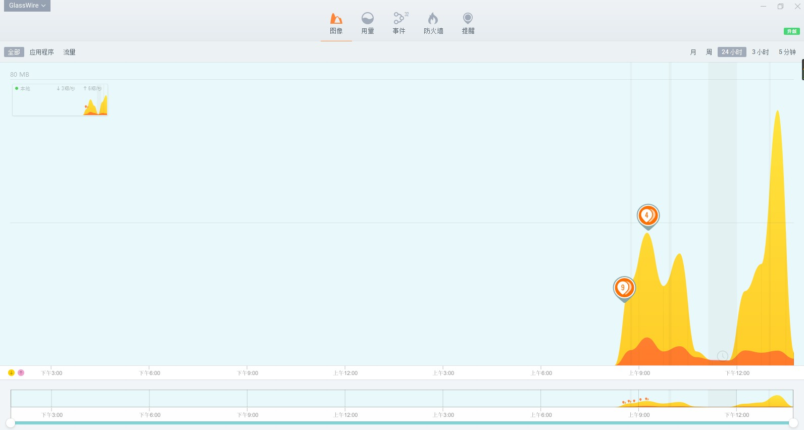
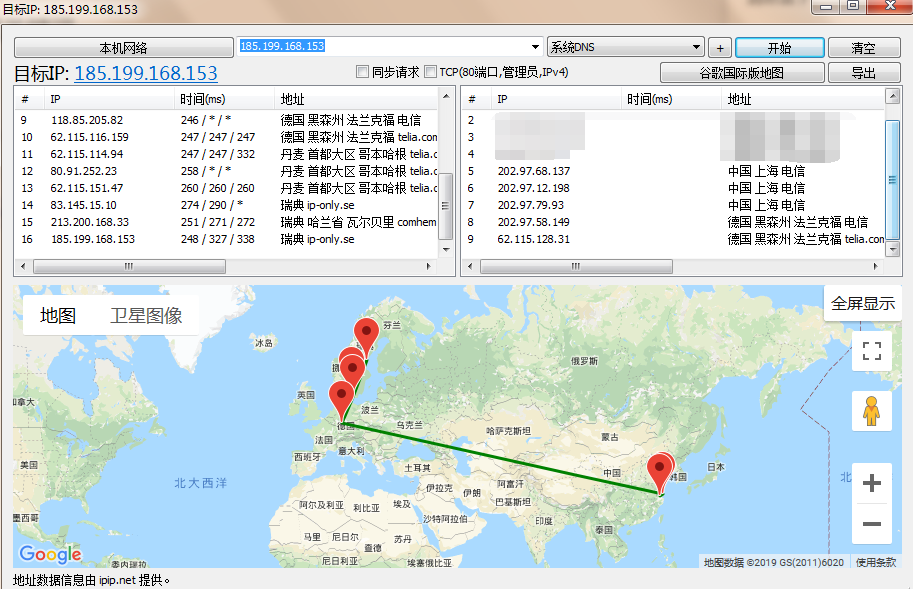

## Comodo Firewall
  

> WORLD’S #1 FREE FIREWALL
Protect your PC from viruses, malware, and hackers.

科摩多防火墙。

## TinyWall

TinyWall is a lightweight, user-friendly, and secure firewall for Windows. It is also completely free.

https://tinywall.pados.hu/

## SimpleWall

Simple tool to configure Windows Filtering Platform (WFP) which can configure network activity on your computer. 

https://www.henrypp.org/product/simplewall

## GlassWire

  

> Detect hidden threats with GlassWire's Firewall

一款防火墙软件,也是网络流量即时监控工具和分析器，可视化网络分析工具,支持程序云查毒。

## NetLimiter
 

> NetLimiter is an ultimate internet traffic control and monitoring tool designed for Windows. Finally, you will become master over your internet connection.

一款控制应用程序连接情况，网络监视与防护软件。

## Best Trace
 

由ipip出品的 traceroute 请求可视图工具，支持全平台[`Windows` 、`macOS`、 `Linux`、 `Android`、`iOS`]，支持批量PING，批量TRACE路由跟踪等。

----

 TrafficMonitor: 桌面显示电脑资源情况