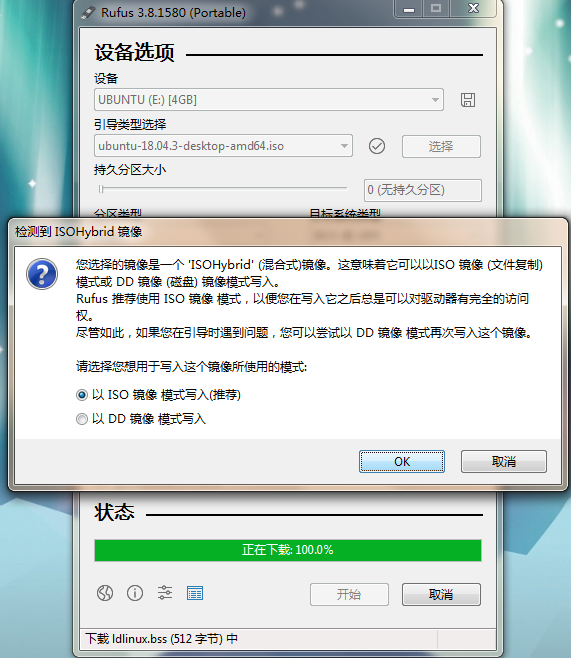
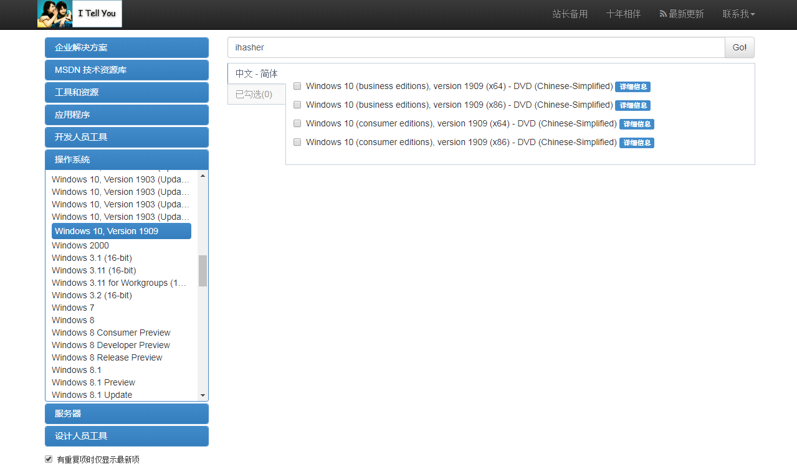

## 大白菜
    

老牌的一键装机工具， 支持GHO ISO WIN ESD SWM快速装机，支持苹果电脑识别安装 优化智能快速装机 大幅提升工作效率。

##  老毛桃
    

另一个老牌的一键U盘启动装机工具。

## 优启通

    

优启通(EasyU)是IT天空精心打造的一款系统预安装环境(PE)，它具有简约、易操作等特点，使用起来十分人性化。以U盘作为使用载体，空间更为充分，携带更为方便。

## 微PE工具箱

    

精巧、简单、纯净的值得信赖的PE工具箱。

## Rufus
   

开源的USB启动盘创建工具。

## 驱动资源

驱动总裁(DrvCeo)是一款集成了目前电脑最实用的驱动大全的离线版驱动总合安装程序,如果您相对电脑的驱动进行整合性的安装可以下载这款驱动总裁离线版(DrvCeo)使用。

驱动精灵

驱动人生

360驱动大师

## 装机资源网站

装机之家(操作系统资源，支持各种网盘下载)：http://www.songyongzhi.com/ / http://www.songyongzhi.com/

Win11资源: [https://www.puresys.net/系统下载/windows11](https://www.puresys.net/%e7%b3%bb%e7%bb%9f%e4%b8%8b%e8%bd%bd/windows11)

远航技术: https://www.far123.com/

MSDN：https://msdn.itellyou.cn/

微软官方: https://www.microsoft.com/zh-cn/software-download

---

windows安装器.EXE