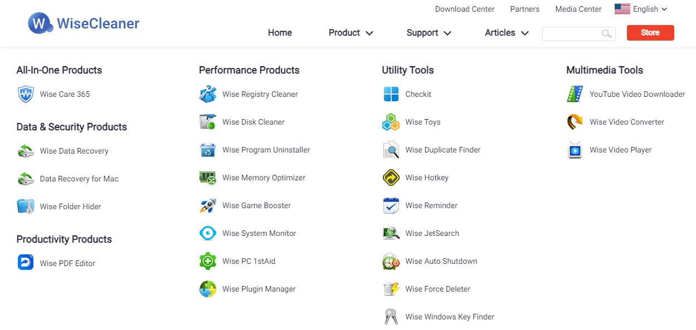

## Iobit Sytemcare

http://www.advancedsystemcare.cn/pc/

IObit出品的一系列系统优化小工具, 一款易于使用的Windows电脑优化工具，帮助用户清洁、优化、加速和保护系统,以及保护用户的在线隐私。

Advanced SystemCare: http://www.iobit.com/advancedsystemcareper.html, iobit出品的系统优化与清理套件。

## PowerToys

> Windows system utilities to maximize productivity

Github: https://github.com/microsoft/PowerToys

指南：https://learn.microsoft.com/zh-cn/windows/powertoys/

微软开发者开发的免费实用工具集，可以用于高级用户调整和简化 Windows 操作，以提高效率。

## GlaryUtilities

Glary Utilities, 一款系统维护的瑞士军刀, 系统优化和维护软件，适用于Windows操作系统， 也具有文件恢复、软件卸载、启动管理等实用功能。

官网: https://www.glarysoft.com/

## Wise Care Cleaner

 

> Clean registry and junk files from your PCs. Protect your privacy and make your PCs more secure. Provide a better option of optimizing and accelerating your computer!

由WiseCleaner开发的一款用来管理、维护、配置以及解决电脑故障免费软件，标称注册表清洁度超过CCleaner。

Wise Disk Cleaner：https://www.wisecleaner.com/wise-disk-cleaner.html， Free Disk Cleanup and Defragment Tool

## TuneUp Utilities

 

来自德国的清洁、优化和故障排除，优秀的付费软件。