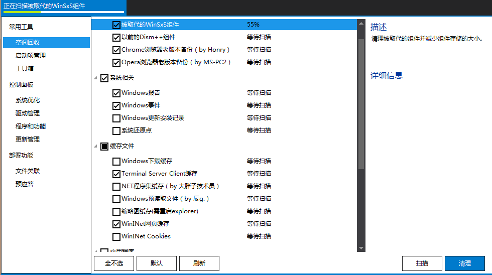
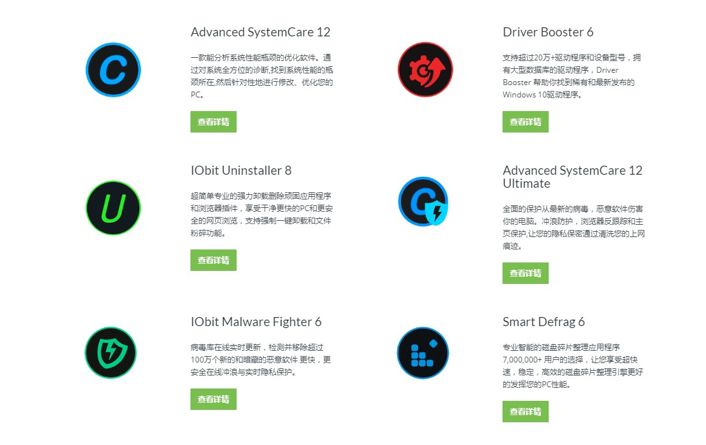

### WinDirStat 

一款磁盘使用情况查看器和清洁器。

### CleanMyPC  

知名的系统清理和维护软件。

### Advanced SystemCare  

iobit出品的系统优化与清理套件。

###   

> CCleaner is the number-one tool for cleaning your PC.
It protects your privacy and makes your computer faster and more secure!

来自 piriform 梨子公司产品的多功能老牌清理优化软件，提供垃圾清理、注册表清理、软件卸载、启动项管理、右键菜单清理、浏览器插件清理、重复文件清理、磁盘分析、软件更新(国内不能用)、系统还原等实用功能，免费版基本够用。

### Dism++  

基于微软API开发，小巧简洁的国产系统优化工具箱。

### Glary Utilities 

一款系统维护的瑞士军刀。

### Wise Care 365  

> Clean registry and junk files from your PCs. Protect your privacy and make your PCs more secure. Provide a better option of optimizing and accelerating your computer!

由WiseCleaner开发的一款用来管理、维护、配置以及解决电脑故障免费软件，标称注册表清洁度超过CCleaner。

### Iobit Sytemcare 12 

一款易于使用的Windows电脑优化工具，帮助用户清洁、优化、加速和保护系统,以及保护用户的在线隐私。

### TuneUp Utilities  

来自德国的清洁、优化和故障排除，优秀的付费软件。
