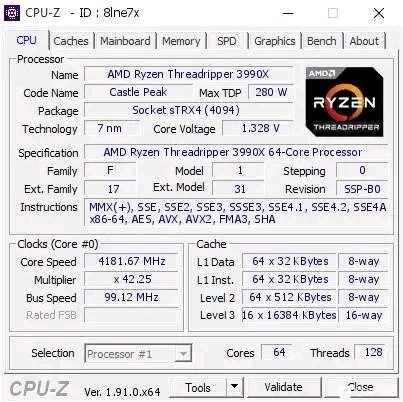
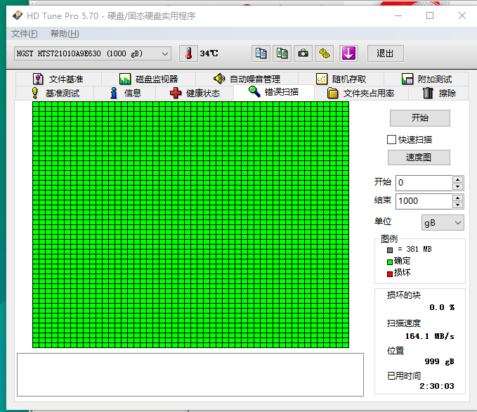

## CPU/GPU工具

> https://www.techpowerup.com/download/sysinfo/

### CPU-Z

知名的CPU检测软件。

### GPU-Z 

知名的GPU检测软件。

### CoreTemp

CPU数字温度传感器

### Super Pi

一款计算圆周率的软件,用来测试CPU的稳定性。

### prime95

残酷的CPU稳定性测试软件。

### wPrime

一款通过算质数来测试计算机运算能力等的软件（特别是并行能力），但与Super Pi只能支持单线程不同的是，wPrime最多可以支持八个线程，也就是说可以支持八核心处理器，并且测试多核心处理器性能时比Super Pi更准确。

---

linX: 一款基于Intel Linpack数学核心库的稳定性测试软件

### Intel XTU

英特尔® 至尊调试实用程序 (Intel® XTU), 由英特尔官方推出的一款cpu调优工具,适用于英特尔所有型号的CPU, 进行诸如超频、监视和强调系统,还可以通过降电压的方式给cpu降温等。

## 磁盘工具

### CrystalDiskInfo

   

> A HDD/SSD utility software which supports a part of USB, Intel RAID and NVMe.

出自Crystal mark的 HDD/SSD 磁盘信息工具。

 http://crystalmark.info/en/download/#CrystalDiskInfo

### CrystalDiskMark
 

> CrystalDiskMark is benchmark software that measures the transfer speed of media data storage drive such as HD, SSD, USB memory, SD card and NAS.

出自Crystal Mark的开源硬盘读写速度测试工具，同样支持Shizuku版本

### HD Tune

简单易用的硬盘检测工具。

### AS SSD Benchmark

来自德国的SSD专用测试软件, 通过测试连续读写速度、4KB随机读写等来评价SSD的综合性能。

(西西中文) http://www.33lc.com/soft/62781.html#download_addr

### SSD-Z

显示SSD信息的固态硬盘检测软件, 不过也支持检测HDD。

(绿茶中文) http://www.33lc.com/soft/62781.html#download_addr

https://www.cr173.com/soft/53396.html

### PrimoCache
  

一款可以把物理内存虚拟成硬盘缓存的硬盘优化软件。

### MyDiskTest

U盘扩容检测工具, 提供了快速扩容测试、数据完整性校验、读写速度测试三种测试方式，能够检测U盘的完整性。

----

## 内存工具

### MEMTEST

Windows下内存检测工具。

### Memtest64

一款小巧绿色的电脑系统内存稳定性测试软件，可以直接在win系统桌面下测试，支持32和64位系统,由GPUZ厂商techpowerup出品。

### Memreduct

内存自动清理工具

## 屏幕工具

### displayX 

一款小巧的显示器测试工具

### 显示器色域检测工具Monitorinfo

图吧出品的显示器色域检测工具。

### f.lux 

依当前城市经纬度日出日落时间的变化来调整显示器色温以适应当前环境亮度，保护你的眼睛。

### LightBulb 

类似f.lux的，调节屏幕以减缓眼部疲劳。

## 键盘工具

### SharpKeys 

  

> SharpKeys is a utility that manages a Registry key that allows Windows to remap one key to any other key.

官网：http://www.randyrants.com/

最新版本：https://github.com/randyrants/sharpkeys/releases/tag/v3.9.4

键盘修改与锁定工具，目前集成在POWERTOYS工具集中

### Keytweak

KeyTweak 通过设置系统的注册表来将按键A映射到按键B，键盘按键修改器

 http://www.yx12345.com/pcpd/7036/3043.html#pcrjxzwai

 http://www.uzzf.com/soft/42949.html

NOTE: It seems that registry mapping is not possible with windows 10

http://winrus.com/keyboard.htm

## 鼠标工具

## 电池工具

### BatteryCare 

一个易于使用的笔记本电脑电池监控软件。